# Task-agnostic per-protein annotation

Part 1 of the GraDi target-prioritization pipeline. See
[`pipeline.md`](./pipeline.md) for the index and the diagram style legend.

This layer produces per-protein evidence that is independent of the downstream
prioritization axes. Each track below runs once per reference proteome and
writes a TSV under `data/processed/` keyed by UniProt accession (or, for
BV-BRC-anchored tracks, by locus tag). Nine tracks — structural annotation
(PDB coverage + AlphaFold pLDDT), the family/domain pair (PANTHER +
InterPro), conservation (BV-BRC PATtyFams plus three planned flavors:
within-Kp pan-genome, cross-species broad-spectrum, and selectivity vs
human), and bibliometric popularity — are joined to form the task-agnostic
annotation table that all task-specific scorers consume. ESM2 embeddings are
kept as a separate per-protein artifact (a vector per protein), not as a
column in the joined table.

```mermaid
%%{init: {'theme':'base','themeVariables':{'primaryColor':'#FAD782','primaryBorderColor':'#50285A','primaryTextColor':'#50285A','lineColor':'#50285A','secondaryColor':'#8CC8FA','tertiaryColor':'#BEE6B4','fontFamily':'Inter, system-ui, sans-serif'}}}%%
flowchart TD
    classDef source    fill:#AA96FA,stroke:#50285A,stroke-width:1.5px,color:#1F0F2E
    classDef dataset   fill:#FAD782,stroke:#50285A,stroke-width:1.5px,color:#50285A
    classDef method    fill:#8CC8FA,stroke:#50285A,stroke-width:1.5px,color:#50285A
    classDef result    fill:#BEE6B4,stroke:#50285A,stroke-width:2px,color:#50285A,font-weight:bold
    classDef tagnostic fill:#DCA0DC,stroke:#50285A,stroke-width:1.5px,color:#50285A
    classDef stub      fill:#FAA08C,stroke:#50285A,stroke-width:1.5px,stroke-dasharray:6 3,color:#50285A
    classDef planned   fill:#D2D2D0,stroke:#7A7A78,stroke-width:1px,stroke-dasharray:5 5,color:#5A5A58

    SRC["UniProt reference proteome<br/>UP000007841 — <i>K. pneumoniae</i> HS11286<br/>5,728 proteins<br/><sub>columns: accession · gene_names · sequence</sub>"]:::source

    SRC --> ESM2["ESM2 embeddings<br/><sub>per-protein 1280-d vector</sub><br/><sub>(planned · standalone output, not joined)</sub>"]:::planned

    subgraph STRUC [" Structural annotation "]
        PDB["PDB coverage<br/><sub>PDBe SIFTS bulk mapping</sub><br/><sub>scripts/02_structural_coverage.py</sub>"]:::method
        AF["AlphaFold pLDDT<br/><sub>AlphaFold DB per-prediction API</sub><br/><sub>scripts/02_structural_coverage.py</sub>"]:::method
    end
    SRC --> PDB
    SRC --> AF

    subgraph FAMDOM [" Family &amp; domain annotation "]
        PAN["PANTHER family / subfamily<br/><sub>UniProt xref_panther</sub><br/><sub>scripts/01_annotate_panther.py</sub>"]:::method
        INT["InterPro domains<br/><sub>UniProt xref_interpro / InterProScan</sub><br/><sub>(planned)</sub>"]:::planned
    end
    SRC --> PAN
    SRC --> INT

    subgraph CONSERVE [" Conservation "]
        CONS_IDS["BV-BRC PATtyFams<br/><sub>PLFam / PGFam IDs · has_plfam</sub><br/><sub>src/conservation.py · data/raw/bvbrc/hs11286_features.tsv</sub>"]:::method
        CONS_KP["Within-Kp pan-genome class<br/><sub>core · soft-core · shell · cloud</sub><br/><sub>needs PLFam genome counts (BV-BRC bulk)</sub><br/><sub>(planned)</sub>"]:::planned
        CONS_XS["Cross-species broad-spectrum<br/><sub>PGFam member counts + OrthoDB group sizes</sub><br/><sub>(planned · reuses Section 2's OrthoDB pull)</sub>"]:::planned
        CONS_SEL["Selectivity vs human<br/><sub>human-ortholog presence + identity %</sub><br/><sub>(planned · inverse signal — high = safety red flag)</sub>"]:::planned
    end
    SRC --> CONS_IDS
    SRC --> CONS_KP
    SRC --> CONS_XS
    SRC --> CONS_SEL

    SRC --> POP["Bibliometric / popularity<br/>UniProt annotation depth + Europe PMC counts<br/><sub>popularity_tier: dark · studied · well_studied</sub><br/><sub>scripts/02_annotate_popularity.py</sub>"]:::method

    PDB  --> T["Task-agnostic per-protein annotation table<br/><sub>joined by UniProt accession (locus_tag for BV-BRC)</sub>"]:::result
    AF   --> T
    PAN  --> T
    INT  --> T
    CONS_IDS --> T
    CONS_KP  --> T
    CONS_XS  --> T
    CONS_SEL --> T
    POP  --> T
```

## Tracks

| Track | Input | Resource | Script | Output |
| --- | --- | --- | --- | --- |
| ESM2 embeddings | sequence | ESM2-650M (1280-d) | _planned_ | _planned (standalone vector store)_ |
| PDB coverage *(structural)* | accession | PDBe SIFTS bulk mapping | `scripts/02_structural_coverage.py` | `pdb_*` columns of `data/processed/<slug>_structural_coverage.tsv` |
| AlphaFold pLDDT *(structural)* | accession | AlphaFold DB per-prediction API | `scripts/02_structural_coverage.py` | `afdb_*` columns of `data/processed/<slug>_structural_coverage.tsv` |
| PANTHER family / subfamily *(family & domain)* | UniProt xref | PANTHER HMM library | `scripts/01_annotate_panther.py` | `data/processed/<slug>_panther.tsv` |
| InterPro domains *(family & domain)* | UniProt xref / sequence | InterPro / InterProScan | _planned_ | _planned_ |
| Cross-strain conservation | locus_tag | BV-BRC PATtyFams (PLFam / PGFam) | `src/conservation.py` | `plfam_id`, `pgfam_id`, `has_plfam` in the assembled table |
| Bibliometric / popularity | accession + gene_symbol | UniProt annotation depth + Europe PMC search | `scripts/02_annotate_popularity.py` | `data/processed/<slug>_popularity.tsv` (incl. `popularity_tier`) |

The reference proteome itself is produced by `scripts/00_download_proteome.py`
(UniProt stream API → `data/raw/<slug>_proteome.tsv`). BV-BRC conservation is
listed here because it is per-protein and task-agnostic; downstream sections
(notably [essentiality](./04_essentiality.md)) treat it as a confidence
modifier rather than a primary signal.

---

**Next:** [Ligandability assessment](./02_ligandability.md) ·
[Degradability assessment](./03_degradability.md) ·
[Essentiality / vulnerability assessment](./04_essentiality.md)
