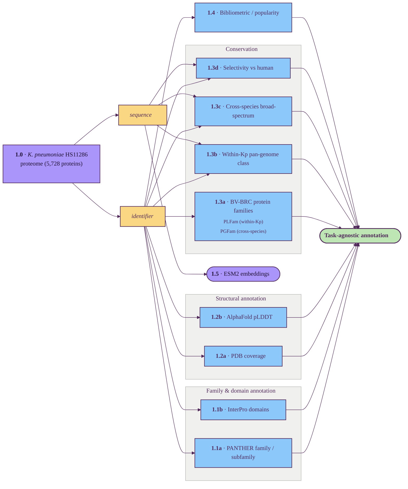

# Task-agnostic per-protein annotation

Part 1 of the GraDi target-prioritization pipeline. See
[`pipeline.md`](./pipeline.md) for the index and the diagram style legend.

This layer produces per-protein evidence that is independent of the downstream
prioritization axes. Each track below runs once per reference proteome and
writes a TSV under `data/processed/` keyed by UniProt accession (or, for
BV-BRC-anchored tracks, by locus tag). Nine tracks — structural annotation
(PDB coverage + AlphaFold pLDDT), the family/domain pair (PANTHER +
InterPro), conservation (BV-BRC protein families plus three planned flavors:
within-Kp pan-genome, cross-species broad-spectrum, and selectivity vs
human), and bibliometric popularity — are joined to form the task-agnostic
annotation table that all task-specific scorers consume. ESM2 embeddings are
kept as a separate per-protein artifact (a vector per protein), not as a
column in the joined table.

## Tracks

| ID | Title | Description | Resources |
| --- | --- | --- | --- |
| 1.0 | Reference proteome | The *K. pneumoniae* HS11286 proteome (5,728 proteins) — anchor that every downstream track derives from. | UniProt |
| 1.1a | PANTHER family / subfamily | Functional protein-family classification from PANTHER HMMs. | UniProt, PANTHER |
| 1.1b | InterPro domains | Domain-composition annotation. | UniProt, InterPro |
| 1.2a | PDB coverage | Fraction of residues covered by experimentally-resolved PDB chains. | PDB, PDBe SIFTS |
| 1.2b | AlphaFold pLDDT | Predicted-structure confidence summarised across the protein (high / confident / low residue fractions). | AlphaFold DB |
| 1.3a | BV-BRC protein families | PLFam (within-Kp) and PGFam (global) cluster IDs from the BV-BRC PATtyFam pan-genome system. | BV-BRC |
| 1.3b | Within-Kp pan-genome class | Is the gene core / soft-core / shell / cloud across *K. pneumoniae* strains? | BV-BRC, OrthoFinder / DIAMOND |
| 1.3c | Cross-species broad-spectrum | Phyletic spread across bacterial pathogens (ESKAPE-E) — broad-spectrum signal. | BV-BRC, OrthoDB, BLAST |
| 1.3d | Selectivity vs human | Does a close human ortholog exist? Inverse signal — high similarity is a safety red flag. | UniProt (human), OrthoDB, eggNOG |
| 1.4 | Bibliometric / popularity | How well-studied the protein is, combining UniProt annotation depth and literature counts → tier: dark / studied / well_studied. | UniProt, Europe PMC |
| 1.5 | ESM2 embeddings | Standalone per-protein 1280-d language-model vector — kept separately, not joined into the task-agnostic annotation. | ESM2-650M |

The reference proteome (UniProt **UP000007841**, *K. pneumoniae* HS11286,
5,728 proteins; columns: accession · gene_names · sequence) is produced by
`scripts/00_download_proteome.py` (UniProt stream API →
`data/raw/<slug>_proteome.tsv`). The **task-agnostic annotation** is the
result of joining the nine non-standalone tracks above by UniProt accession
(with `locus_tag` as the join key for BV-BRC-anchored tracks). Conservation is
listed here because it is per-protein and task-agnostic; downstream sections
(notably [essentiality](./04_essentiality.md)) treat it as a confidence
modifier rather than a primary signal. The within-Kp pan-genome class also
acts as a strain-coverage filter, and selectivity-vs-human is an inverse
signal carried into the final ranking as a safety axis.

---

**Next:** [Ligandability assessment](./02_ligandability.md) ·
[Degradability assessment](./03_degradability.md) ·
[Essentiality / vulnerability assessment](./04_essentiality.md)
