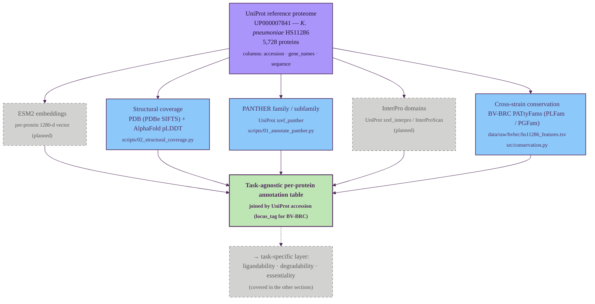

# Task-agnostic per-protein annotation

Part 1 of the GraDi target-prioritization pipeline. See
[`pipeline.md`](./pipeline.md) for the index and the diagram style legend.

This layer produces per-protein evidence that is independent of the downstream
prioritization axes. Each track below runs once per reference proteome and
writes a TSV under `data/processed/` keyed by UniProt accession (or, for
BV-BRC conservation, by locus tag); the five outputs are joined to form the
task-agnostic annotation table that all task-specific scorers consume.

## Tracks

| Track | Input | Resource | Script | Output |
| --- | --- | --- | --- | --- |
| ESM2 embeddings | sequence | ESM2-650M (1280-d) | _planned_ | _planned_ |
| Structural coverage | accession | PDBe SIFTS, AlphaFold DB | `scripts/02_structural_coverage.py` | `data/processed/<slug>_structural_coverage.tsv` |
| PANTHER family / subfamily | UniProt xref | PANTHER HMM library | `scripts/01_annotate_panther.py` | `data/processed/<slug>_panther.tsv` |
| InterPro domains | UniProt xref / sequence | InterPro / InterProScan | _planned_ | _planned_ |
| Cross-strain conservation | locus_tag | BV-BRC PATtyFams (PLFam / PGFam) | `src/conservation.py` | `plfam_id`, `pgfam_id`, `has_plfam` in the assembled table |

The reference proteome itself is produced by `scripts/00_download_proteome.py`
(UniProt stream API → `data/raw/<slug>_proteome.tsv`). BV-BRC conservation is
listed here because it is per-protein and task-agnostic; downstream sections
(notably [essentiality](./04_essentiality.md)) treat it as a confidence
modifier rather than a primary signal.

---

**Next:** [Ligandability assessment](./02_ligandability.md) ·
[Degradability assessment](./03_degradability.md) ·
[Essentiality / vulnerability assessment](./04_essentiality.md)
