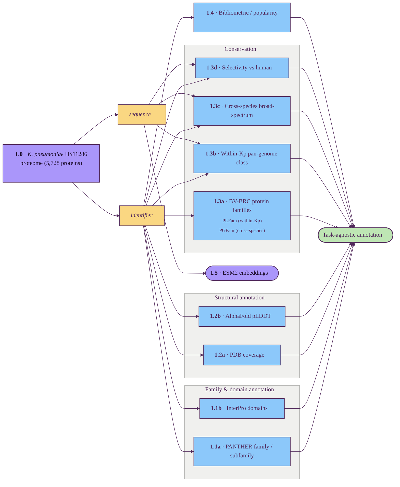

# Task-agnostic per-protein annotation

This layer produces general-purpose protein annotation not directly related to the PoI requirements.

## Tracks

| ID | Title | Description | Resources |
| --- | --- | --- | --- |
| 1.0 | Reference proteome | The *K. pneumoniae* HS11286 proteome (5,728 proteins) — anchor that every downstream track derives from. | UniProt |
| 1.1a | PANTHER family / subfamily | Functional protein-family classification from PANTHER HMMs. | UniProt, PANTHER |
| 1.1b | InterPro domains | Domain-composition annotation. | UniProt, InterPro |
| 1.2a | PDB coverage | Fraction of residues covered by experimentally-resolved PDB chains. | PDB, PDBe SIFTS |
| 1.2b | AlphaFold pLDDT | Predicted-structure confidence summarised across the protein (high / confident / low residue fractions). | AlphaFold DB |
| 1.3a | BV-BRC protein families | PLFam (within-Kp) and PGFam (global) cluster IDs from the BV-BRC PATtyFam pan-genome system. | BV-BRC |
| 1.3b | Within-Kp pan-genome class | Is the gene core / soft-core / shell / cloud across *K. pneumoniae* strains? | BV-BRC, OrthoFinder / DIAMOND |
| 1.3c | Cross-species broad-spectrum | Phyletic spread across bacterial pathogens (ESKAPE-E) — broad-spectrum signal. | BV-BRC, OrthoDB, BLAST |
| 1.3d | Selectivity vs human | Does a close human ortholog exist? Inverse signal — high similarity is a safety red flag. | UniProt (human), OrthoDB, eggNOG |
| 1.4 | Bibliometric / popularity | How well-studied the protein is, combining UniProt annotation depth and literature counts → tier: dark / studied / well_studied. | UniProt, Europe PMC |
| 1.5 | ESM2 embeddings | Standalone per-protein 1280-d language-model vector — kept separately, not joined into the task-agnostic annotation. | ESM2-650M |

## Key resources

| Resource | Description | Tracks |
| --- | --- | --- |
| [UniProt](https://www.uniprot.org/) | Universal protein sequence and annotation knowledgebase; source of the reference proteome, gene names, cross-references and curation depth. | 1.0, 1.1a, 1.1b, 1.2a, 1.2b, 1.3d, 1.4 |
| [PANTHER](https://www.pantherdb.org/) | Phylogeny-based protein family / subfamily classification built from HMMs. | 1.1a |
| [InterPro](https://www.ebi.ac.uk/interpro/) | Integrated database of protein domains, families and functional sites from member signature databases. | 1.1b |
| [RCSB PDB](https://www.rcsb.org/) | Archive of experimentally-determined 3D macromolecular structures. | 1.2a |
| [PDBe SIFTS](https://www.ebi.ac.uk/pdbe/docs/sifts/) | Residue-level mapping between PDB chains and UniProt sequences. | 1.2a |
| [AlphaFold DB](https://alphafold.ebi.ac.uk/) | EMBL-EBI archive of AlphaFold2-predicted structures with per-residue pLDDT confidence. | 1.2b |
| [BV-BRC](https://www.bv-brc.org/) | Bacterial / viral bioinformatics resource (formerly PATRIC); supplies the PATtyFam protein families (PLFam, PGFam) and pan-genome context. | 1.3a, 1.3b, 1.3c |
| [OrthoFinder](https://github.com/davidemms/OrthoFinder) | Tool for inferring orthogroups across a set of proteomes. | 1.3b |
| [DIAMOND](https://github.com/bbuchfink/diamond) | Fast accelerated protein sequence aligner, BLAST-compatible; used as the search engine for ortholog detection. | 1.3b, 1.3c |
| [OrthoDB](https://www.orthodb.org/) | Hierarchical catalog of orthologous gene groups across bacteria, eukaryotes and viruses. | 1.3c, 1.3d |
| [NCBI BLAST](https://blast.ncbi.nlm.nih.gov/) | Sequence similarity search service against NCBI reference databases. | 1.3c |
| [eggNOG](http://eggnog5.embl.de/) | Orthology resource with hierarchical functional annotation across taxa. | 1.3d |
| [Europe PMC](https://europepmc.org/) | Open literature database (PubMed + preprints + full text) used for publication / mention counts. | 1.4 |
| [ESM-2](https://github.com/facebookresearch/esm) | Meta AI protein language model; the 650M-parameter variant supplies the per-protein 1280-d embeddings. | 1.5 |

## Suggestions

_Audit findings from a 2026-05 literature review; not yet wired into the diagram or Tracks table._

### Add

- **[DeepLocPro 1.0](https://academic.oup.com/bioinformatics/article/40/12/btae677/7900293)** — bacteria-trained subcellular-localization predictor (6 classes, calibrated probabilities). UniProt subcellular fields are sparse or `By similarity` for HS11286. Anchored in §5; flagged here only as a cross-link.
- **[SignalP 6.0](https://www.nature.com/articles/s41587-021-01156-3) + LipoP** — five-class signal-peptide / lipoprotein detection. Lipoprotein flag = "hard for BacPROTAC". Pairs with localization.
- **[Foldseek](https://www.nature.com/articles/s41587-023-01773-0) + [ProstT5](https://academic.oup.com/nargab/article/6/4/lqae150/7901286)** — extend §1.2 from "does a structure exist?" to "is there a structural neighbour with a ligand co-crystal?". 3Di tokens make sub-Å search BLAST-cheap; ProstT5 supplies tokens for sequences without an AlphaFold model.
- **[PPanGGOLiN](https://journals.plos.org/ploscompbiol/article?id=10.1371/journal.pcbi.1007732)** ([GitHub](https://github.com/labgem/PPanGGOLiN)) — would implement the planned §1.3b within-Kp pan-genome partition. HMM/MRF-based, principled core / persistent / shell / cloud splits, scales to ~10⁴ Kp genomes.
- **[eggNOG-mapper v2](https://academic.oup.com/mbe/article/38/12/5825/6379734)** — one pass delivers COG functional category, KEGG / EC / GO, *and* the human-ortholog flag. Would implement §1.3d selectivity-vs-human without a bespoke RBH-BLAST workflow.
- **[MobiDB-lite consensus disorder](https://pmc.ncbi.nlm.nih.gov/articles/PMC7779018/)** — refine §1.2b to emit an IDR consensus call alongside raw pLDDT bins. pLDDT &lt; 50 conflates true disorder with poor MSA coverage and short flexible linkers. *Bacterial note:* bacterial proteomes have lower IDR content than eukaryotes, so a smaller fraction of the proteome will trigger it — still informative for the cases that do.

### Upgrade

- **§1.5 ESM-2-650M → [SaProt-650M](https://github.com/westlake-repl/SaProt)** (ICLR 2024 #1 on ProteinGym) or **[ESM-C 600M](https://www.evolutionaryscale.ai/blog/esm-cambrian)**. SaProt fuses 3Di structure tokens with sequence — free upgrade because §1.2b already supplies the structures. Skip only if a downstream classifier is already trained against ESM-2's 1280-d space.
- **§1.2a PDB coverage → "structural coverage + Foldseek neighbours"** — SIFTS only flags identity-mapped coverage; Foldseek vs the PDB-ligand-bound subset gives a much stronger BacPROTAC-relevant signal.
- **§1.3a BV-BRC PATtyFams: keep, snapshot locally.** NIAID BRC funding renewed Sept 2024 — data is current, but cache PLFam / PGFam tables to insulate against future outages.

### Skip

- [Pharos / TCRD](https://pharos.nih.gov/) (human-only).
- CDD / Pfam-HMMER direct (InterPro already integrates them).
- GearNet / MSA-Transformer / ESM-3-multimodal (weaker or overkill vs SaProt / ESM-C).
- [CARD](https://card.mcmaster.ca/) / [MEGARes](https://www.meglab.org/megares/) / TTD as a §1 axis (resistance / human-target catalogs, wrong scope).
- HHrepID / coiled-coil predictors (niche; InterPro covers it).
- DeepTMHMM as a §1 track (duplicative with §5).
- Bacterial PTM predictors (limited training data).
