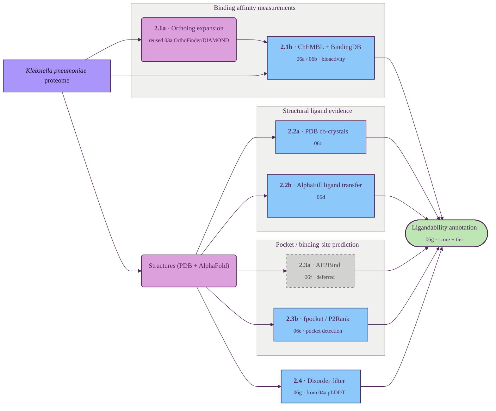

# Ligandability assessment

Combines direct and ortholog-mediated ligand evidence (ChEMBL + BindingDB), structural ligand evidence (PDB co-crystals + AlphaFill) and pocket / binding-site prediction (AF2Bind, fpocket, P2Rank) to score whether a small-molecule recruiter could engage the target.

## Tracks

| ID | Title | Description | Resources |
| --- | --- | --- | --- |
| 2.1a | Ortholog expansion (reused) | Fan each Kp protein into its ortholog set so sparse direct activity data on HS11286 can be lifted from related bacteria. **Reuses the existing 03a OrthoFinder/DIAMOND table** (`data/processed/other/orthology/<prefix>_orthologs_long.tsv`; tiers klebsiella/gram_negative/bacteria/human) rather than a fresh OrthoDB fetch. | 03a orthology |
| 2.1b | ChEMBL + BindingDB bioactivity | Ki / Kd / IC50 records pulled both directly for the Kp protein and (more importantly) across its bacterial ortholog set, drawn from both ChEMBL and BindingDB. | ChEMBL, BindingDB |
| 2.2a | PDB co-crystals | Scan PDB for protein-ligand co-crystal chains covering the Kp protein or its orthologs — direct empirical evidence of binding. | RCSB PDB |
| 2.2b | AlphaFill ligand transfer | Plausible ligands grafted onto the AlphaFold model from homologous PDB entries. | AlphaFill |
| 2.3a | AF2Bind binding-site prediction | Per-residue ligand-binding predictions from AlphaFold2's pair representation. | AF2Bind |
| 2.3b | fpocket / P2Rank pocket detection | Pocket detection on PDB / AlphaFold structures — volume, hydrophobicity, druggability scores. | fpocket, P2Rank |
| 2.4 | Disorder filter | Penalises proteins with a high fraction of low-pLDDT residues (proxy for intrinsic disorder). | AlphaFold DB |

## Key resources

| Resource | Description | Tracks |
| --- | --- | --- |
| [ChEMBL](https://www.ebi.ac.uk/chembl/) | Manually-curated bioactivity database (Ki / Kd / IC50, pChEMBL). | 2.1b |
| [BindingDB](https://www.bindingdb.org/) | Public protein–ligand binding-affinity database; complements ChEMBL with additional measured activities. | 2.1b |
| [AlphaFill](https://alphafill.eu/) | Companion to AlphaFold DB that transplants ligands and cofactors from homologous PDB entries onto AlphaFold models. | 2.2b |
| [AF2Bind](https://github.com/sokrypton/af2bind) | Predicts small-molecule binding residues using AlphaFold2's pair representation. | 2.3a |
| [fpocket](https://github.com/Discngine/fpocket) | Fast open-source pocket-detection algorithm based on Voronoi tessellation. | 2.3b |
| [P2Rank](https://github.com/rdk/p2rank) | Machine-learning predictor of ligand-binding sites from protein structure. | 2.3b |

## Suggestions

- **[PocketMiner](https://www.nature.com/articles/s41467-023-36699-3)** — cryptic / induced pocket prediction (GVP-GNN); new sub-track 2.3c. *Bacterial caveat:* eukaryote-leaning training — sanity-check on bacterial apo/holo pairs first.
- **[CryptoBank PLM](https://www.science.org/doi/10.1126/sciadv.ady6364)** ([cryptobankdb.com](https://cryptobankdb.com/)) — sequence-based cryptic prior; PLM head is organism-agnostic but training is eukaryote-dominated. Use as secondary signal.
- **[FTMap](https://pmc.ncbi.nlm.nih.gov/articles/PMC4762777/)** — computational solvent / hot-spot mapping for ternary-complex landing pads; new track 2.5. Organism-agnostic.
- **[PASSer](https://academic.oup.com/nar/article/51/W1/W427/7145694)** — allosteric site prediction; orthogonal BacPROTAC handle. *Bacterial caveat:* training is eukaryote-heavy — positive signal only, no penalty for absence.
- **[canSAR](https://academic.oup.com/nar/article/53/D1/D1287/7899530) + [DoGSiteScorer](https://www.zbh.uni-hamburg.de/en/forschung/amd/software/dogsitescorer.html)** — attach a calibrated druggability number to §2.3b pockets; canSAR 2024 covers AlphaFold across organisms (confirm Kp coverage on first use).
- **§2.2a PDB co-crystals → [BioLiP2](https://academic.oup.com/nar/article/52/D1/D404/7233921)** — pre-curated (biological-unit-aware, filters artefacts, weekly sync).
- **§2.4 disorder filter: keep pLDDT-fraction or swap to [AIUPred](https://academic.oup.com/nar/article/52/W1/W176/7673484)** for one calibrated number.

## Implementation (`scripts/06*`)

Run per organism (`--organism {kpneumoniae,ecoli}`). Each track writes a per-protein CSV
keyed by `uniprot_accession`; `06g` merges them with the AlphaFold confidence (04a) into the
final `output/results/<org>/<prefix>_ligandability.csv`. Shared helpers in `src/ligandability.py`.

**Sequence mapping (critical).** HS11286 is a dark TrEMBL proteome whose accessions rarely equal
the (reviewed / other-strain) accessions used by ChEMBL, BindingDB and PDB-SIFTS. Exact-accession
matching therefore silently misses *direct* K. pneumoniae data — including the clinically central
SHV / OXA-48 / CTX-M / NDM / AmpC β-lactamases. So **06a, 06b and 06c map our proteins to external
targets by SEQUENCE** (DIAMOND blastp, `gradi-ortho`), reporting `%identity` and bucketing by
organism (for human selectivity). A hit at **≥95% identity is treated as "direct"** (the same
protein, any strain); lower-identity hits are homolog/ortholog evidence. PDB uses `pdb_seqres`
(all PDB chains) as the search target, so co-crystals are found regardless of SIFTS accession.

| Script | Track | Key output columns |
| --- | --- | --- |
| `06a_chembl_bioactivity.py` | 2.1b | sequence-mapped. `chembl_{direct,bact,human,any}_{n_compounds,n_potent}`, `chembl_*_best_pchembl`, `chembl_direct_{acc,organism,pident}` |
| `06b_bindingdb_bioactivity.py` | 2.1b | sequence-mapped. `bindingdb_{direct,bact,human,any}_{n_compounds,n_potent}`, `bindingdb_*_best_paff`, `bindingdb_direct_{acc,organism,pident}` |
| `06c_pdb_cocrystals.py` | 2.2a | `pdb_lig_{direct(own),seqdirect(≥95%),ortho,seqhom,any}_has_druglike`, `*_n_druglike`, `*_ligand_ids`, `*_pdb_ids`, `*_pident` |
| `06d_alphafill_ligands.py` | 2.2b | `alphafill_available`, `alphafill_n_transplants`, `alphafill_n_druglike`, `alphafill_best_identity`, `alphafill_best_ligand` |
| `06e_pockets.py` | 2.3b | `fpocket_{n_pockets,max_drug_score,best_volume,best_hydrophobicity,best_pocket_plddt}`, `p2rank_{n_pockets,top_score,top_prob,top_pocket_plddt}`, `pocket_consensus_score` (pLDDT-weighted) |
| `06f_af2bind.py` | 2.3a | **deferred** — `af2bind_max_score` (NaN placeholder) |
| `06g_ligandability_merge.py` | 2.4 + result | `disorder_frac`, `disorder_penalty`, `evidence_{binding,structural,pocket}`, `has_hard_evidence`, `human_ligandable_family`, `selectivity`, **`ligandability_score`** [0–1], **`ligandability_tier`** {tractable,partial,intractable}. Also writes `<prefix>_ligandability_shortlist.csv` — broad-spectrum, human-selective, tractable targets ranked by evidence then score. |
| `06h_ligandability_plots.py` | — | `output/plots/06h_ligandability.png` (evidence sources · tiers · pocket quality · prime targets) |

**Composite (06g, tunable constants):** `ligandability_score = 0.45·binding + 0.30·structural +
0.25·pocket` (continuous ranking), where `pocket = pLDDT-weighted fpocket/P2Rank consensus ×
disorder_penalty`. **Tiers are evidence-driven** (not just score thresholds): `tractable` if there
is hard evidence (any ≤1 µM activity, or an own / ≥95%-id PDB co-crystal), OR a strong homolog
ligand site (`evidence_structural ≥ 0.70`), OR a strong druggable pocket (`evidence_pocket ≥ 0.50`),
OR score ≥ 0.60; `partial` if a plausible pocket (`≥ 0.30`) / any structural transplant / any tested
compound / score ≥ 0.35; else `intractable`. Mostly-disordered proteins (`disorder_frac ≥ 0.50`)
without hard evidence are forced `intractable`. Human activity contributes a discounted binding
signal (family is druggable) but is kept in separate columns since it is not selective.

**Data resources (eosvc, gitignored):** ChEMBL SQLite (`data/raw/other/chembl/`), BindingDB TSV
(`data/raw/other/bindingdb/`). PDBe/AlphaFill responses cached under `data/processed/`.
