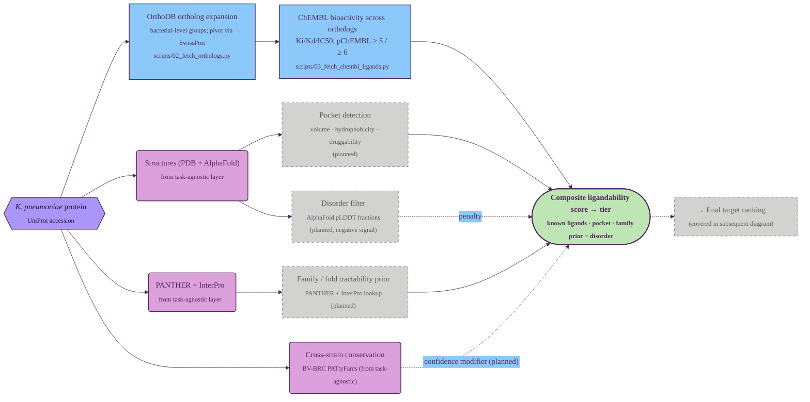

# Ligandability assessment

Part 2 of the GraDi target-prioritization pipeline. See
[`pipeline.md`](./pipeline.md) for the index and the diagram style legend.

Ligandability asks whether a small-molecule recruiter could engage the target —
the key tractability question for BacPROTAC discovery. We combine three
positive signals — known ligands transferred from bacterial orthologs (the
lift, since *K. pneumoniae* itself has almost no direct ChEMBL coverage),
structure-based pocket druggability, and a family/fold prior — with one
negative signal — predicted disorder.

## Tracks

| Track | Input | Resource | Script | Output |
| --- | --- | --- | --- | --- |
| OrthoDB ortholog expansion | gene symbol | OrthoDB via UniProt (SwissProt pivot) | `scripts/02_fetch_orthologs.py` | `data/processed/klebsiella_pneumoniae_orthodb_orthologs.tsv` |
| ChEMBL bioactivity | UniProt + orthologs | ChEMBL REST (`/target`, `/activity`) | `scripts/03_fetch_chembl_ligands.py` | `data/processed/chembl_ligand_counts.tsv` |
| Pocket detection | AlphaFold / PDB structure | _tool TBD_ | _planned_ | _planned_ |
| Family / fold prior | PANTHER + InterPro IDs | curated tractability lookup | _planned_ | _planned_ |
| Disorder filter | AlphaFold pLDDT fractions | already in `*_structural_coverage.tsv` | _planned_ | _planned_ |

The ChEMBL track is the most consequential pillar in the implemented portion:
HS11286 is ~99% TrEMBL, so direct ChEMBL coverage is sparse — almost all the
ligand signal arrives through the OrthoDB expansion step that fans each Kp
protein into a bacterial-wide ortholog set.

---

**Prev:** [Task-agnostic per-protein annotation](./01_task_agnostic.md) ·
**Next:** [Degradability assessment](./03_degradability.md) ·
[Essentiality / vulnerability assessment](./04_essentiality.md)
