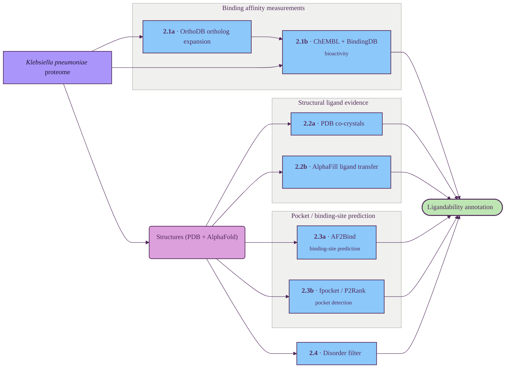

# Ligandability assessment

Combines direct and ortholog-mediated ligand evidence (ChEMBL + BindingDB), structural ligand evidence (PDB co-crystals + AlphaFill) and pocket / binding-site prediction (AF2Bind, fpocket, P2Rank) to score whether a small-molecule recruiter could engage the target.

## Tracks

| ID | Title | Description | Resources |
| --- | --- | --- | --- |
| 2.1a | OrthoDB ortholog expansion | Fan each Kp protein into a bacterial-wide ortholog set so sparse direct activity data on HS11286 can be lifted from related bacteria. | OrthoDB |
| 2.1b | ChEMBL + BindingDB bioactivity | Ki / Kd / IC50 records pulled both directly for the Kp protein and (more importantly) across its bacterial ortholog set, drawn from both ChEMBL and BindingDB. | ChEMBL, BindingDB |
| 2.2a | PDB co-crystals | Scan PDB for protein-ligand co-crystal chains covering the Kp protein or its orthologs — direct empirical evidence of binding. | RCSB PDB |
| 2.2b | AlphaFill ligand transfer | Plausible ligands grafted onto the AlphaFold model from homologous PDB entries. | AlphaFill |
| 2.3a | AF2Bind binding-site prediction | Per-residue ligand-binding predictions from AlphaFold2's pair representation. | AF2Bind |
| 2.3b | fpocket / P2Rank pocket detection | Pocket detection on PDB / AlphaFold structures — volume, hydrophobicity, druggability scores. | fpocket, P2Rank |
| 2.4 | Disorder filter | Penalises proteins with a high fraction of low-pLDDT residues (proxy for intrinsic disorder). | AlphaFold DB |

## Key resources

| Resource | Description | Tracks |
| --- | --- | --- |
| [ChEMBL](https://www.ebi.ac.uk/chembl/) | Manually-curated bioactivity database (Ki / Kd / IC50, pChEMBL). | 2.1b |
| [BindingDB](https://www.bindingdb.org/) | Public protein–ligand binding-affinity database; complements ChEMBL with additional measured activities. | 2.1b |
| [AlphaFill](https://alphafill.eu/) | Companion to AlphaFold DB that transplants ligands and cofactors from homologous PDB entries onto AlphaFold models. | 2.2b |
| [AF2Bind](https://github.com/sokrypton/af2bind) | Predicts small-molecule binding residues using AlphaFold2's pair representation. | 2.3a |
| [fpocket](https://github.com/Discngine/fpocket) | Fast open-source pocket-detection algorithm based on Voronoi tessellation. | 2.3b |
| [P2Rank](https://github.com/rdk/p2rank) | Machine-learning predictor of ligand-binding sites from protein structure. | 2.3b |

## Suggestions

_Audit findings from a 2026-05 literature review; not yet wired into the diagram or Tracks table. Single highest-leverage gap: cryptic-pocket coverage. fpocket / P2Rank / AF2Bind all operate on the ground-state surface and miss ligand-induced sites — the natural BacPROTAC handle (ClpC1 NTD itself is famously cyclomarin-induced)._

### Add

- **[PocketMiner](https://www.nature.com/articles/s41467-023-36699-3)** — GVP-GNN trained on apo / holo cryptic pairs and MD trajectories. ROC-AUC 0.87, &gt;1000× faster than MD. Would slot as new sub-track **2.3c** ("Cryptic / allosteric pocket prediction"); complements (not replaces) fpocket / P2Rank. *Bacterial note:* training set is eukaryote-leaning. The model is structure-only so generalises, but sanity-check on bacterial apo/holo pairs (*E. coli* DHFR, *M. tuberculosis* ClpC1 NTD) before relying on the score.
- **[CryptoBank PLM predictor](https://www.science.org/doi/10.1126/sciadv.ady6364)** ([cryptobankdb.com](https://cryptobankdb.com/)) — sequence-based cryptic prior (PR-AUC 0.8 at &gt;20% id) on a 5.5M PDB apo / holo sweep. Companion to PocketMiner. *Bacterial note:* PDB apo / holo sweep is human / eukaryote-dominated. The PLM head is pure-sequence and usable on bacterial proteomes, but treat the bacterial prior as secondary until validated.
- **[FTMap](https://pmc.ncbi.nlm.nih.gov/articles/PMC4762777/)** — computational solvent / hot-spot mapping; catches PPI-style shallow patches that geometry-only tools miss. Organism-agnostic (physics-based probe docking). Would slot as new track **2.5 "Surface hot-spots"** for ternary-complex landing pads.
- **[PASSer](https://academic.oup.com/nar/article/51/W1/W427/7145694)** ([passer.smu.edu](https://passer.smu.edu/)) — allosteric site prediction ensemble (~83% top-3 recall). Allosteric sites are orthogonal BacPROTAC handles. *Bacterial note:* training-set allosteric annotations are eukaryote-heavy. Use as a *positive* signal but absence should not penalise bacterial targets.
- **[canSAR ligandability score](https://academic.oup.com/nar/article/53/D1/D1287/7899530) + [DoGSiteScorer Drug Score](https://www.zbh.uni-hamburg.de/en/forschung/amd/software/dogsitescorer.html)** — attach a *calibrated quantitative druggability number* to detected pockets in §2.3b, not just a flag. canSAR 2024 extends to AlphaFold across organisms (confirm Kp / E. coli coverage on first use); DoGSiteScorer is organism-agnostic.

### Upgrade

- **§2.2a PDB co-crystals → [BioLiP2](https://academic.oup.com/nar/article/52/D1/D404/7233921)**. Same track, pre-curated (biological-unit-aware, filters buffer / cryoprotectants, EC / GO / affinity attached, weekly PDB sync). Near-free win over raw PDB scrape.
- **§2.3b fpocket / P2Rank: keep, attach druggability score** (canSAR + DoGSiteScorer Drug Score). Don't swap to DeepPocket / PUResNet / GrASP / VN-EGNN — 2024 Dundee benchmark shows P2Rank still competitive.
- **§2.4 Disorder filter: keep pLDDT-fraction or swap to [AIUPred](https://academic.oup.com/nar/article/52/W1/W176/7673484)** (AlphaFold-integrated IUPred) for one calibrated number.

### Skip

- [PubChem BioAssay](https://pubchem.ncbi.nlm.nih.gov/) (QC noise; ChEMBL covers the curated subset), Drug Target Commons (duplicative), [DrugBank](https://go.drugbank.com/) (eukaryote-skewed), PDBbind / BindingMOAD (subsumed by BioLiP2), CARD / MEGARes / TTD (wrong scope), [sc-PDB](http://bioinfo-pharma.u-strasbg.fr/scPDB/) (stale 2017), CrossDocked / COACH / CSAR / D3R (benchmarks, not annotation), DeepPocket / PUResNet / Kalasanty / GrASP / VN-EGNN (marginal gain over P2Rank), SiteMap (commercial, no edge over canSAR + DoGSiteScorer), PocketGen / GeoBind (design tools), KFC2 / HotPoint / ANCHOR (subsumed by FTMap), [Probes & Drugs portal](https://www.probes-drugs.org/home/) (overwhelmingly human-target focused; adds no bacterial coverage beyond ChEMBL + BindingDB), bacterial PROTAC-DBs (none curated yet).
