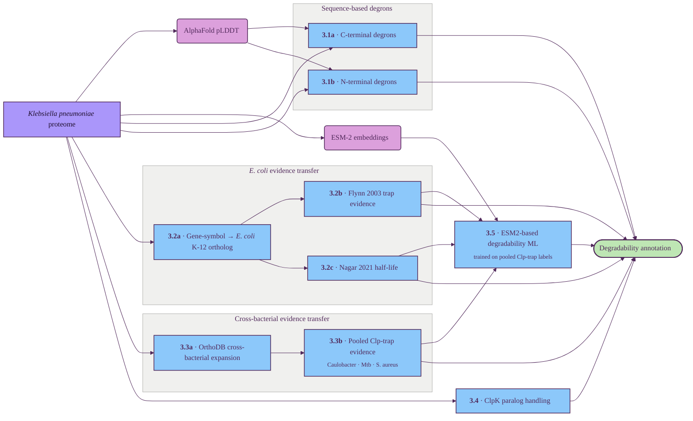

# Degradability assessment

Combines rule-based degron motifs on each Kp sequence (modulated by AlphaFold structural exposure) with experimental Clp-substrate evidence transferred from *E. coli* K-12 (gene-symbol orthology) and from other bacteria (OrthoDB expansion) to score how susceptible the target is to bacterial Clp-protease degradation.

## Tracks

| ID | Title | Description | Resources |
| --- | --- | --- | --- |
| 3.1a | C-terminal degrons | Match ssrA-like (CM1, -LAA family) and MuA-like (CM2) C-terminal motifs on the sequence, downweighted when the C-terminus sits in a high-pLDDT (folded) region rather than an exposed disordered tail. | sequence regex (CM1, CM2), AlphaFold pLDDT |
| 3.1b | N-terminal degrons | Apply the N-end rule (L/F/Y/W at position 2) and Flynn NM1/2/3 motifs, downweighted when the N-terminus is buried (high pLDDT) rather than exposed. | sequence regex, Flynn 2003 motif definitions, AlphaFold pLDDT |
| 3.2a | Gene-symbol → *E. coli* ortholog | Look up each Kp gene symbol against the *E. coli* K-12 reference proteome — bridge step for the two paper-derived *E. coli* evidence streams below. | UniProt *E. coli* K-12 (UP000000625) |
| 3.2b | Flynn 2003 trap evidence | Via the matched *E. coli* ortholog, flag whether the protein was trapped by ClpXP / ClpAP in Flynn et al.'s substrate-trap experiment. | Flynn 2003 |
| 3.2c | Nagar 2021 half-life | Via the matched *E. coli* ortholog, transfer the half-life class from Nagar et al.'s pulsed-SILAC measurements. | Nagar 2021 |
| 3.3a | OrthoDB cross-bacterial expansion | Expand each Kp protein into a bacterial-wide ortholog set via OrthoDB (mirroring §2.1a) so substrate-trap data from non-*E. coli* model species can be transferred. | OrthoDB |
| 3.3b | Pooled cross-bacterial Clp-trap evidence | For each Kp protein, flag whether any of its bacterial orthologs appears in a Clp substrate-trap experiment in *C. crescentus* (Bhat 2013), *M. tuberculosis* ClpC1 (Lunge 2020) or *S. aureus* (Feng 2013) — phyletic breadth of trap evidence. | Bhat 2013, Lunge 2020, Feng 2013 |
| 3.4 | ClpK paralog handling | *Klebsiella*-specific Clp heat-shock paralog (ClpK) with no *E. coli* ortholog — would need a dedicated rule set / HMM. | *Klebsiella* ClpK literature |
| 3.5 | ESM2-based degradability ML | Train a classifier on per-protein ESM-2 embeddings (§1.5) using pooled Clp-trap and half-life labels (Flynn 2003 + Nagar 2021 + cross-bacterial traps) as supervision, then apply to each Kp protein. | ESM-2 embeddings (§1.5); Flynn 2003, Nagar 2021, cross-bacterial trap pool |

## Key papers

| Paper | Description | Tracks |
| --- | --- | --- |
| [Flynn et al. 2003, *Mol. Cell*](https://doi.org/10.1016/S1097-2765(03)00060-1) | Proteomic discovery of ClpXP substrates in *E. coli*; defines the five recognition-signal classes (CM1/CM2 C-terminal, NM1/2/3 N-terminal) used by 3.1a/3.1b and supplies the trap census consumed by 3.2b. | 3.1a, 3.1b, 3.2b, 3.5 |
| [Nagar et al. 2021, *mSystems*](https://doi.org/10.1128/msystems.01296-20) | Pulsed-SILAC measurement of half-lives across 1,602 *E. coli* proteins — source of the half-life class used by 3.2c and a supervision signal for 3.5. | 3.2c, 3.5 |
| [Bhat et al. 2013, *Mol. Microbiol.*](https://doi.org/10.1111/mmi.12241) | ClpP-trap proteomic identification of substrates in *Caulobacter crescentus* — contributes to the pooled cross-bacterial evidence in 3.3b. | 3.3b, 3.5 |
| [Lunge et al. 2020, *J. Biol. Chem.*](https://doi.org/10.1074/jbc.RA120.013456) | Identifies the substrate set of *M. tuberculosis* ClpC1 via proteomic profiling of ClpC1 knockdown strains and shows disordered termini as the dominant recognition signal — directly relevant for BacPROTAC-style ClpC1 recruitment. | 3.3b, 3.5 |
| [Feng et al. 2013, *J. Proteome Res.*](https://doi.org/10.1021/pr300394r) | ClpPtrap substrate identification in *S. aureus*, including ClpXP- and ClpCP-specific subsets. | 3.3b, 3.5 |

## Suggestions

_Audit findings from a 2026-05 literature review; not yet wired into the diagram or Tracks table. The two biggest gaps are biological, not ML: (a) the diagram implicitly assumes Kp carries the full E. coli adaptor stack — it should be a checked feature; (b) the dominant in-vivo source of ssrA tags is rare-codon-driven tmRNA tagging, not intrinsic CM1 motifs._

### Add

- **Adaptor-presence gate (SspB / ClpS / RssB)** as new **3.0 "adaptor census"** boolean feature set. Without ClpS, the N-end rule (§3.1b) is essentially mute; without SspB, ssrA delivery is degraded. Sources: [Wang et al. 2007 *Genes Dev*](https://www.genesdev.org/cgi/doi/10.1101/gad.1546207) (ClpS modulatory role) and the Schmitz / Sauer ClpS structural literature.
- **tmRNA-tagging propensity** as new **3.1c**. Combine (a) rare-codon density in the last ~50 nt of the CDS, (b) [RNAfold (ViennaRNA)](https://www.tbi.univie.ac.at/RNA/) MFE in a sliding window across the stop codon, (c) internal Shine-Dalgarno-like aSD hits. [Hayes & Sauer 2002 *PNAS*](https://www.pnas.org/doi/10.1073/pnas.052707199): rare-codon clusters drive tmRNA tagging far more than intrinsic CM1 motifs.
- **σ32 (RpoH) + σS (RpoS) regulon membership** as a low-cost binary co-variate via *E. coli* ortholog ([Nonaka 2006](https://genesdev.cshlp.org/content/20/13/1776.full): σ32 regulon mapping; cross-reference [RegulonDB](https://regulondb.ccg.unam.mx/)). Slots in §3.2 alongside Flynn / Nagar.
- **Extend §3.3b pool**: [Ziemski 2021 *FEBS J*](https://febs.onlinelibrary.wiley.com/doi/10.1111/febs.15335) (Mtb ClpCP genome-wide BACTH, 25/67 TA antitoxins as substrates) and the [Graham 2013 *S. aureus* ClpC trap](https://jb.asm.org/content/195/19/4506) (complements Feng's ClpP trap). Apply per-paper weights.

### Upgrade

- **§3.4 ClpK: reframe from black box to "disaggregase modifier".** The [Ballim / Achilonu 2025 bioRxiv](https://www.biorxiv.org/content/10.1101/2025.11.28.691151v1.full) places ClpK closest to ClpB (44.3% identity) — a disaggregase, not a degron-recogniser. No characterised substrate motif; no cyclomarin-style NTD pocket mapped. Treat ClpK presence as a *modifier* (higher solubility under stress → harder to degrade), not as a parallel CM1 / CM2 track.
- **§3.5 ESM-2 → [SaProt](https://www.biorxiv.org/content/10.1101/2023.10.01.560349v1)** (preferred — exposure intrinsic to its 3Di tokens) or [ESM-C 600M](https://www.evolutionaryscale.ai/blog/esm-cambrian). Multi-task across Flynn + Bhat + Lunge + Feng + Graham + Ziemski + Nagar pooled labels with per-paper bias terms. Hold out one organism for ortholog generalisation check.
- **§3.1a / §3.1b: adaptor-gated weights.** A CM1 hit on a genome without SspB should contribute zero; N-end-rule hits with no ClpS should be zero. Combine the new §3.0 census with the §3.1 score.
- **§3.2c Nagar half-life caveat**: [Olivares / Sauer](https://www.nature.com/articles/nrmicro.2015.20) reviews caution that ~half of short-half-life proteins in *E. coli* are Lon substrates, not ClpXP. Either narrow the label (Nagar contributes only when Flynn agrees) or carry a Lon-overlap covariate.

### Skip

- CtsR regulon (Gram-positive only), McsB phospho-Arg pathway (Gram+ only), Bachair / TerminFinder / DegPred / [UbiBrowser](http://ubibrowser.bio-it.cn/) (eukaryotic / unmaintained), [Degronopedia](https://degronopedia.com/) (no bacterial extension), MecA / YpbH / YjbH adaptors (Gram+ only). Lon / FtsH / HslUV other proteases: mention as a covariate caveat in §3.0 but don't expand scope.
