# Degradability assessment (Clp proteases)

Part 3 of the GraDi target-prioritization pipeline. See
[`pipeline.md`](./pipeline.md) for the index and the diagram style legend.

Degradability asks how susceptible the target is to bacterial Clp-protease
degradation — directly informative for BacPROTAC design since the recruiter
hands the substrate to ClpC/ClpX/ClpP for proteolysis. There is no
proteome-wide Clp-substrate measurement for *K. pneumoniae*, so the score
combines two evidence streams: rule-based degron motifs computed directly on
each Kp sequence, plus experimental evidence transferred from *E. coli* K-12
by gene-symbol orthology. Note that this layer does **not** consume the
task-agnostic outputs (structures, families, embeddings) — it works directly
on the raw sequence plus two curated reference TSVs.

```mermaid
%%{init: {'theme':'base','themeVariables':{'primaryColor':'#FAD782','primaryBorderColor':'#50285A','primaryTextColor':'#50285A','lineColor':'#50285A','secondaryColor':'#8CC8FA','tertiaryColor':'#BEE6B4','clusterBkg':'#F0F0EE','clusterBorder':'#B0B0AE','titleColor':'#50285A','fontFamily':'Inter, system-ui, sans-serif'}}}%%
flowchart LR
    classDef source    fill:#AA96FA,stroke:#50285A,stroke-width:1.5px,color:#1F0F2E
    classDef dataset   fill:#FAD782,stroke:#50285A,stroke-width:1.5px,color:#50285A
    classDef method    fill:#8CC8FA,stroke:#50285A,stroke-width:1.5px,color:#50285A
    classDef embedding fill:#8CC8FA,stroke:#50285A,stroke-width:1.5px,color:#50285A
    classDef result    fill:#BEE6B4,stroke:#50285A,stroke-width:2px,color:#50285A,font-weight:bold
    classDef tagnostic fill:#DCA0DC,stroke:#50285A,stroke-width:1.5px,color:#50285A
    classDef stub      fill:#FAA08C,stroke:#50285A,stroke-width:1.5px,stroke-dasharray:6 3,color:#50285A
    classDef planned   fill:#D2D2D0,stroke:#7A7A78,stroke-width:1px,stroke-dasharray:5 5,color:#5A5A58

    P{{"<i>K. pneumoniae</i> protein<br/><sub>UniProt accession · sequence · gene_symbol</sub>"}}:::source

    P --> CTERM["C-terminal degrons<br/><sub>CM1 ssrA-like (-LAA family), CM2 MuA-like</sub><br/><sub>scripts/03_annotate_clp_degradability.py</sub>"]:::method
    P --> NTERM["N-terminal degrons<br/><sub>N-end rule (L/F/Y/W at pos 2), Flynn NM1/2/3</sub><br/><sub>scripts/03_annotate_clp_degradability.py</sub>"]:::method

    P --> ORTH["Gene-symbol → <i>E. coli</i> K-12 ortholog<br/><sub>direct symbol match (not OrthoDB — Flynn/Nagar evidence is E. coli-specific)</sub><br/><sub>scripts/03_annotate_clp_degradability.py</sub>"]:::method
    ORTH --> FLYNN[("Flynn 2003 ClpXP/ClpAP trap census<br/><sub>data/raw/clp_substrates/flynn2003_ecoli_clp_substrates.tsv</sub>")]:::dataset
    ORTH --> NAGAR[("Nagar 2021 <i>E. coli</i> half-lives<br/><sub>data/raw/clp_substrates/nagar2021_ecoli_halflives.tsv</sub>")]:::dataset

    P -.-> CLPK["ClpK paralog handling<br/><sub>Kp-specific heat-shock Clp; no E. coli ortholog</sub><br/><sub>(planned)</sub>"]:::planned
    P -.-> ESM2["ESM2-based degradability ML<br/><sub>per-protein embedding → learned classifier</sub><br/><sub>(planned; see task-agnostic layer)</sub>"]:::planned

    CTERM --> SCORE(["Composite clp_degradability_score → tier<br/><sub>rule features (≤1.0) + 0.4 if trapped + 0.2/0.1 by t½ class</sub><br/><sub>src/degradability.py → src/assemble.py</sub>"]):::result
    NTERM --> SCORE
    FLYNN --> SCORE
    NAGAR --> SCORE
    CLPK -.-> SCORE
    ESM2 -.-> SCORE

    SCORE -.-> NEXT["→ final target ranking<br/><sub>(covered in subsequent diagram)</sub>"]:::planned
```

## Tracks

| Track | Input | Resource | Script | Output |
| --- | --- | --- | --- | --- |
| C-terminal degrons | sequence | CM1 (ssrA-family) + CM2 (MuA-family) regex | `scripts/03_annotate_clp_degradability.py` | `cterm_ssra_like`, `cterm_mua_like` in `data/processed/klebsiella_pneumoniae_clp_degradability.tsv` |
| N-terminal degrons | sequence | N-end rule + Flynn 2003 NM1/2/3 | `scripts/03_annotate_clp_degradability.py` | `nterm_destabilizing`, `nterm_nm1/2/3` |
| Gene-symbol → *E. coli* ortholog | gene_symbol | local symbol match against `data/raw/escherichia_coli_proteome.tsv` | `scripts/03_annotate_clp_degradability.py` | `ecoli_ortholog_uniprot`, `ortholog_status` |
| Flynn 2003 trap census | E. coli gene_symbol | curated from Flynn 2003 + Sauer/Baker reviews | `scripts/03_annotate_clp_degradability.py` | `ecoli_clp_trapped`, `ecoli_clp_class` |
| Nagar 2021 half-lives | E. coli gene_symbol | curated from Nagar 2021 pulsed-SILAC | `scripts/03_annotate_clp_degradability.py` | `ecoli_halflife_class`, `ecoli_halflife_min` |
| ClpK paralog handling | sequence + Kp-specific HMM | Klebsiella ClpK literature | _planned_ | _planned_ |
| ESM2-based degradability ML | ESM2 embedding | re-train of Nagar 2021's 188-feature classifier | _planned_ | _planned_ |

Two architectural notes worth highlighting:

- **Why gene-symbol matching, not OrthoDB.** The two reference TSVs are
  *E. coli K-12-specific* (Flynn 2003 and Nagar 2021 both used MG1655). A
  bacterial-wide OrthoDB expansion (as used by the
  [ligandability layer](./02_ligandability.md)) would not add evidence — the
  labels only exist for E. coli. Simple symbol matching covers the ~18% of
  HS11286 entries that carry a canonical gene symbol; the rest fall through
  to the rule-based score alone.
- **Why this layer doesn't consume task-agnostic outputs.** Clp recognition
  is dominated by short linear motifs (terminal degrons) and biophysical
  flexibility. The current v1 captures the motif signal directly from
  sequence; structure-based / ESM2-based extensions are explicitly planned
  (dashed) — they would close the loop back to the
  [task-agnostic layer](./01_task_agnostic.md) once built.

---

**Prev:** [Ligandability assessment](./02_ligandability.md) ·
**Next:** [Essentiality / vulnerability assessment](./04_essentiality.md) ·
[Task-agnostic per-protein annotation](./01_task_agnostic.md)
