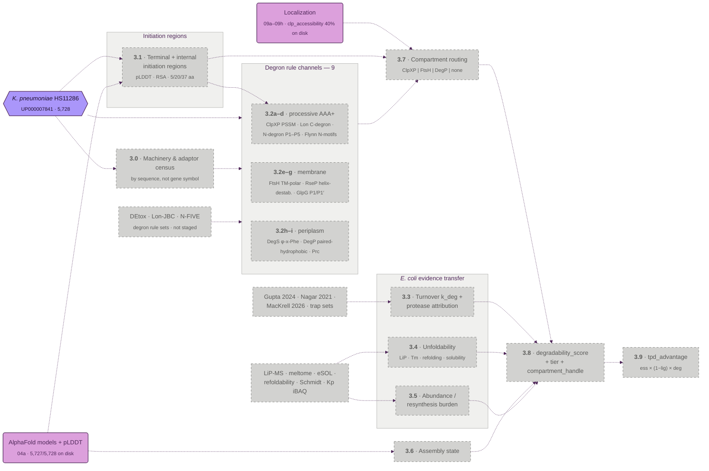

# Degradability assessment

Scores how amenable each protein is to **protease-mediated removal by a chemically recruited bacterial
protease** — the target-side prerequisite for a BacPROTAC/CLIPPER-style degrader. Because neither
*Klebsiella* nor *E. coli* encodes ClpC or McsB (§3.0 — the absence is a property of Enterobacteriaceae), the
axis is **not** "Clp degradability" in the Firmicute/Actinobacteria sense. It is routed by **subcellular
compartment** across **nine channels in two architectural classes**: five ATP-powered processive AAA+ machines
(ClpXP, ClpAP+ClpS, Lon, HslUV, FtsH) and four ATP-independent endoproteolytic envelope proteases (RseP, GlpG,
DegS, DegP/Prc). For each protein it combines (i) an accessible unstructured *initiation region* read off the
AlphaFold model — which gates the AAA+ channels **only**, (ii) empirically-derived degron rule channels,
(iii) measured turnover and protease attribution, (iv) biophysical unfoldability, and (v) abundance /
assembly-state modifiers.

> ## ⚠ Protease decision, established 2026-08-06 — read this before the rest of the spec
>
> The recruiting handle is **ClpP, engaged directly by a small-molecule activator, with NO unfoldase
> partner**. This is not an open question and never was: the funded Gr-ADI research vision
> (`Gr-ADI_ResearchVision_TPD-vs-Gram-Negs_Draft-v5(Final)_MDF.docx`) names it — *"reduce target protein
> levels by selectively engaging the bacterial ClpP protease"*, *"BacPROTACs that **activate** the ClpP
> protease"* — and WP2 is called **WP2_ClpPELs** (ClpP-Engaging Ligands). ClpC is *explicitly* ruled out for
> Gram-negatives in that document. Chemistry in hand: ONC212 (first scaffold), an (R)-ZG197 derivative already
> tested on **purified Kp ClpP**, ACP6-12, the ZG/ZY series. First targets are **DnaK** and **AcpP** (FabI was
> a v3 target and is superseded); second targets **GyrA/GyrB**.
>
> **The mechanistic consequence reshapes this spec.** Activated ClpP has no motor: ADEP-class activators
> occupy the hydrophobic clefts where the ClpX/ClpA (L/I)GF loops dock, opening the axial pore and ordering the
> catalytic triad, but *nothing pulls*. So the **initiation-region rule that this document is built on is an
> unfoldase rule** — it belongs to Regime A. Under Regime B (partnerless ClpP) the substrate must **already be
> unstructured enough to diffuse into an open pore**: substantial intrinsic disorder, low conformational
> stability, a nascent chain, or a natively dynamic assembly. Hence ADEP's canonical victim is FtsZ and hence
> ADEPs chew nascent chains at the ribosome. Two direct corroborations from our own data: Jacques 2020 reports
> the 200 most-depleted proteins are enriched for ribosome-related functions, and our 10c transfer puts
> **trigger factor** and a run of ribosomal proteins at the very top.
>
> Therefore: **global disorder, `two_domain_architecture` (Edkins's "partly disordered, partly ordered"), and
> conformational stability are first-class features**, and the nine-channel survey below is demoted from a
> scoring structure to a fallback register. See the deck and `degradability_report.md` §"Gr-ADI project
> context".
>
> ***E. coli* K-12 is the primary organism for this axis, and Kp the transfer organism** — an inversion of
> every other axis in the repo. Every experimental dataset in this field is E. coli, so E. coli values are
> direct evidence while Kp values are transferred, capped at **3,179/5,728 = 55.5%** by orthology. Building
> E. coli first also gives the axis its own internal validation set: Gupta 2024 measures half-lives for **3,263**
> proteins across **13** conditions **including Δ*clpP* / Δ*lon* / Δ*hslV* / triple / Δ*smpB***, keyed on UniProt
> accessions — a per-protein change in half-life on protease deletion is a *label*, not a feature. The
> machinery itself is near-identical between the two organisms (verified by pairwise alignment at 76–99%
> identity), so rules derived in E. coli transfer with a clear conscience; see §"Kp vs Ec" in the report.

> **Implementation status (updated 2026-08-06): partially built.** What exists and has been run:
> `src/degradability.py` (shared helpers, corrected motifs with archetype self-tests, growth-corrected
> turnover, per-paper trap weights with a ClpC cap), `scripts/10a_fetch_degradability.py` (9-dataset manifest +
> fetch ladder + `--stage`), `scripts/10b_degrons.py` (motifs + terminal pLDDT exposure, full proteome), and
> `scripts/10c_clpp_activator.py` (the **Regime B / partnerless** evidence track — ADEP4 + ONC212 transferred
> onto Kp/Ec). Still unbuilt: global disorder / `two_domain_architecture`, the biophysics and assembly-state
> tracks, the compartment router, the merge, and all plots.
>
> **The webapp is still serving the old values** and must not be trusted: the Kp values come from a frozen
> legacy file (`data/processed/legacy/klebsiella_pneumoniae_clp_degradability.tsv`) written by a since-deleted
> regex script with four verified defects, and **the E. coli values are a deterministic MD5 mock**. Both should
> be retired the moment the merge lands. See `docs/degradability_report.md` §1 for the accounting and §5 for
> why the legacy score is close to information-free.


```mermaid
%%{init: {'theme':'base','themeVariables':{'primaryColor':'#FAD782','primaryBorderColor':'#50285A','primaryTextColor':'#50285A','lineColor':'#50285A','secondaryColor':'#8CC8FA','tertiaryColor':'#BEE6B4','clusterBkg':'#F0F0EE','clusterBorder':'#B0B0AE','titleColor':'#50285A','fontFamily':'Inter, system-ui, sans-serif'}}}%%
flowchart LR
    classDef source    fill:#AA96FA,stroke:#50285A,stroke-width:1.5px,color:#1F0F2E
    classDef dataset   fill:#FAD782,stroke:#50285A,stroke-width:1.5px,color:#50285A
    classDef method    fill:#8CC8FA,stroke:#50285A,stroke-width:1.5px,color:#50285A
    classDef embedding fill:#AA96FA,stroke:#50285A,stroke-width:1.5px,color:#1F0F2E
    classDef result    fill:#BEE6B4,stroke:#50285A,stroke-width:2px,color:#50285A
    classDef tagnostic fill:#DCA0DC,stroke:#50285A,stroke-width:1.5px,color:#50285A
    classDef stub      fill:#FAA08C,stroke:#50285A,stroke-width:1.5px,stroke-dasharray:6 3,color:#50285A
    classDef planned   fill:#D2D2D0,stroke:#7A7A78,stroke-width:1px,stroke-dasharray:5 5,color:#5A5A58

    P{{"<i>K. pneumoniae</i> HS11286<br/><sub>UP000007841 · 5,728</sub>"}}:::source

    AF("AlphaFold models + pLDDT<br/><sub>04a · 5,727/5,728 on disk</sub>"):::tagnostic
    LOC("Localization<br/><sub>09a–09h · clp_accessibility 40% on disk</sub>"):::tagnostic

    CENSUS["<b>3.0</b> · Machinery &amp; adaptor census<br/><sub>by sequence, not gene symbol</sub>"]:::planned

    subgraph INIT [" Initiation regions "]
        direction LR
        TERM["<b>3.1</b> · Terminal + internal<br/>initiation regions<br/><sub>pLDDT · RSA · 5/20/37 aa</sub>"]:::planned
    end

    subgraph DEGRONS [" Degron rule channels — 9 "]
        direction LR
        AAA["<b>3.2a–d</b> · processive AAA+<br/><sub>ClpXP PSSM · Lon C-degron ·<br/>N-degron P1–P5 · Flynn N-motifs</sub>"]:::planned
        MEM["<b>3.2e–g</b> · membrane<br/><sub>FtsH TM-polar · RseP helix-destab. · GlpG P1/P1′</sub>"]:::planned
        PERI["<b>3.2h–i</b> · periplasm<br/><sub>DegS φ-x-Phe · DegP paired-hydrophobic · Prc</sub>"]:::planned
    end

    subgraph XFER [" <i>E. coli</i> evidence transfer "]
        direction LR
        TURN["<b>3.3</b> · Turnover k_deg +<br/>protease attribution"]:::planned
        BIO["<b>3.4</b> · Unfoldability<br/><sub>LiP · Tm · refolding · solubility</sub>"]:::planned
        ABU["<b>3.5</b> · Abundance /<br/>resynthesis burden"]:::planned
    end

    ASM["<b>3.6</b> · Assembly state"]:::planned
    ROUTE["<b>3.7</b> · Compartment routing<br/><sub>ClpXP | FtsH | DegP | none</sub>"]:::planned

    D1["DEtox · Lon-JBC · N-FIVE<br/><sub>degron rule sets · not staged</sub>"]:::planned
    D2["Gupta 2024 · Nagar 2021 ·<br/>MacKrell 2026 · trap sets"]:::planned
    D3["LiP-MS · meltome · eSOL ·<br/>refoldability · Schmidt · Kp iBAQ"]:::planned

    SCORE["<b>3.8</b> · degradability_score<br/>+ tier + compartment_handle"]:::planned
    TPD["<b>3.9</b> · tpd_advantage<br/><sub>ess × (1−lig) × deg</sub>"]:::planned

    P -.-> CENSUS
    P -.-> TERM
    P -.-> DEGRONS
    AF -.-> TERM
    AF -.-> ASM
    LOC -.-> ROUTE
    CENSUS -.-> DEGRONS
    D1 -.-> DEGRONS
    D2 -.-> TURN
    D3 -.-> BIO
    D3 -.-> ABU
    TERM -.-> AAA
    TERM -.-> ROUTE
    DEGRONS -.-> ROUTE
    ROUTE -.-> SCORE
    TURN -.-> SCORE
    BIO -.-> SCORE
    ASM -.-> SCORE
    ABU -.-> SCORE
    SCORE -.-> TPD
```

*Gray dashed = not implemented (all of it). Pink = pre-computed inputs that already exist in the repo.*

---

## Why this axis was re-specified

The previous version of this spec assumed the published BacPROTAC modality transfers to *Klebsiella*, scored
degrons from hand-written regexes, and weighted the N-end rule at 0.25. All three assumptions are wrong or
unsupported:

1. **ClpC and McsB are absent from Kp** (§3.0), so the cyclomarin-A BacPROTAC chemotype has no receptor here.
2. **The naive N-end rule shows no proteome-scale association with measured half-life** in *E. coli*
   (Gupta 2024; Nagar 2021) — and it was the only feature in the legacy implementation that fired on a
   meaningful number of proteins (684/5,728).
3. **Motif presence alone does not predict degradation.** Real degrons are usually *latent* — generated by
   endoproteolysis or conformational change — so a motif must be scored jointly with terminal accessibility
   and assembly burial, never on its own.

The full argument, with numbers, is in `docs/degradability_report.md` §2–§3.

---

## Tracks

| ID | Title | Description | Resources |
| --- | --- | --- | --- |
| 3.0 | Machinery & adaptor census | Confirm, **by sequence rather than gene symbol**, which proteases and adaptors the organism encodes, and their essentiality. HS11286 is a TrEMBL proteome with patchy gene naming — `clpA` and `sspB` are present but unnamed, and would be missed by a symbol grep. Establishes which handles are available and which are deletable (a resistance route). | UniProt REST, the 03a OrthoFinder table, `07h` essentiality |
| 3.1 | Terminal & internal initiation regions | The mechanistic core. Per-residue pLDDT from the AlphaFold models already on disk → mean pLDDT over the N- and C-terminal 15/30/50 residues, length of the leading/trailing run below pLDDT 70 and 50, longest internal low-confidence run. Terminal solvent accessibility via Shrake–Rupley. Bucketed against the measured ClpXP thresholds: **~5 aa** (closed-channel recognition), **~20 aa** (open-channel engagement), **~37 aa** (pore-to-active-site reach). Computed **per terminus**, because degradation rate depends on which terminus is pulled. | AlphaFold pLDDT (§1.6), `Bio.PDB.SASA`, `metapredict` |
| 3.2 | **Degron rule channels — nine, in two architectural classes** | See the dedicated table below. The load-bearing distinction is not which protease but **which architecture**: the five ATP-powered AAA+ machines are *processive* (they thread a loose end and destroy the whole chain, so track 3.1 gates them), while the four envelope proteases are *endoproteolytic* (they cut, and need an exposed cleavage site instead — **track 3.1 must not gate them**). Every channel is scored as `rule × accessibility × adaptor-presence`, never rule alone. | see below |
| 3.2a | ClpXP C-degron PSSM | Empirically-derived position-specific matrix from DEtox (~100k measured pentapeptide tags, run in WT/Δ*clpX*/Δ*clpP*): consensus (−5→−1) `[L/F/Y/W]-[L/A/R]-L-A-A`, Ala-Ala at −2/−1 in 91% of top hits, depletions at polar@−5 / bulky-β-branched@−4 / P,H,G@−3. Replaces the hand-written ssrA regex, which could not match ssrA. **Caveat from Lyu 2026: ssrA (C-motif-1) is the mechanistic outlier** — the closed-channel ClpX conformation is optimised for it while native N-motifs use the open channel, so calibrating the whole ClpXP score on ssrA-derived data will mis-rank native substrates. | DEtox; Lyu 2026 |
| 3.2b | Lon C-degron | `x–[L/I]–[L/I/V]–H-COOH`, invariantly ending in His; His@−1 strongly preferred, D/R/K@−1 strongly disfavoured; K_D spans 0.24 → >50 µM. Conserved across *E. coli* / *Yersinia* / *Mycoplasma*, which licenses transfer to Kp. Secondary Lon feature: buried aromatic clusters exposed on misfolding. | Cragan 2025; Gur & Sauer 2008/2009 |
| 3.2c | N-degron P1–P5 (ClpAP + ClpS) | The combinatorial-mutagenesis model over the first five residues (~2.2 M variants): P1 potency `F≈R < L < W≈K≈Y`; **Pro@P2 +1.05 PSI** and Gly@P2 +0.63 rescue a destabilising P1; **Gln@P2 is as destabilising as Leu@P1**; net-negative charge over P2–P5 stabilises; acidic at P3 stabilises. Gated by a correct **MAP Met-excision** step (Met removed when residue 2 ∈ {A,C,G,P,S,T,V}, with V/T much less efficient and P2′–P4′ context able to slow it) and by **Aat substrate status** for N-terminal Arg/Lys — the rule is not "ends up bulky" but "is an Aat substrate". Zeroed when ClpS is absent. | Sen 2025 (+ Methods Enzymol 2025); Frottin 2006; Hirel 1989; Cartwright 2025 |
| 3.2d | Flynn N-motifs 1–3 | **Implemented** from the paper itself (now on disk at `data/raw/other/degradability/literature/`): N-M1 `T-X-K-[ILV]` 1–4 residues in, N-M3 `φ-X-pol-X-pol-X-bas-pol`, N-M2 `^M-[KR]-φ-φ`. Anchored against Flynn's own named proteins (Dps, RpoS, Crl, DksA) with cross-controls in `selftest_motifs()`. NM1/NM3 are **weighted 0 pending measurement**, and are absent from the current `*_deg_degrons.csv` vintage — re-run `10b`. NM2 measures OR 0.87 against Nagar and stays at 0. | Flynn 2003 via PMC2394798 |
| 3.2e | FtsH membrane degron | **Lipid-facing polar residues inside TM helices**, which target even a *folded* membrane protein and do **not** require the long cytosolic tail every earlier FtsH model assumed. Plus the classical thresholds: >~20 aa cytosolic tail at the N-terminus or ~10 aa at the C-terminus. **Must be combined with an accessibility term** — FtsH sits inside an HflK/HflC cage whose aperture is condition-dependent (Iqbal 2026). | Chai-Danino 2026; Chiba 2002; Iqbal 2026 |
| 3.2f | RseP intramembrane | **Helix-destabilising residues within the substrate TM segment**, plus an exposed C-terminal hydrophobic residue. RseP unwinds the TM helix by strand addition and clamps it at a conserved Asn. Essential in both organisms, so undeletable — a resistance-proof handle in principle. | Akiyama/Kanehara lineage; *eLife* 2015; *Sci Adv* 2022 |
| 3.2g | GlpG rhomboid | A **sequence motif at the cleavage site** — small side chain at P1, negative charge at P1′ — which the authors state matters *more* than TM-helix destabilisation, and from which they judge genome-wide substrate prediction feasible. | Strisovsky 2009; Zoll 2014 |
| 3.2h | DegS periplasmic activation | **C-terminal `φ-x-Phe`** (the OMP YxF motif) binds the DegS PDZ domain and switches the protease on by relieving autoinhibition — a *natural molecular glue*, and the mechanism Taylor 2026 engineered for DegP. The motif is **buried in correctly folded membrane-embedded OMPs** and exposed only on misfolding, so the feature is conditional on foldedness. DegS is essential in both organisms. | Walsh/Sohn/Sauer 2007–2010 |
| 3.2i | DegP / Prc periplasmic proteolysis | DegP cleaves **between paired hydrophobic residues**; substrate-enriched dipeptide motifs are what the Taylor 2026 glues exploit. Two 2025 refinements: DegP is **redox-gated** (a disulfide in its own protease domain, plus substrate free-cysteine content), and for at least one metallo-β-lactamase **Prc cleaves first and DegP processes the fragments** — so the periplasmic route may be Prc→DegP. Prc/Tsp itself reads free C-termini, including ssrA tags on exported proteins. | Taylor 2026; Roy 2025; González 2025; Sugimoto 2025 |
| 3.3 | Turnover + protease attribution | Measured degradation-rate constants and half-lives from *E. coli*, plus **which protease is responsible** (from ΔclpP / Δlon / ΔhslV / triple / ΔsmpB panels — **no ΔftsH**, verified 2026-08-06), plus membership of real substrate-trap sets. Direct for E. coli; transferred onto HS11286 by ortholog (`transfer_ecoli_to_kp`). Carries the warning that ~40% of E. coli cytoplasmic proteolysis is attributable to none of the known proteases. | Gupta 2024, Nagar 2021, MacKrell 2026, Neher 2006, FtsH/Lon traps, E. coli N-degradome |
| 3.4 | Biophysical unfoldability | Unfolding is the rate-limiting step of AAA+ degradation, so intrinsic stability matters. **LiP-MS protease-accessibility density** (the most mechanistically apt column available — limited proteolysis measures exactly the accessible-flexible-region property engagement needs), melting temperature residualised on localization, (non-)refoldability, chaperone-free solubility, in-vivo aggregation class, chaperone dependence, and a soft knot-topology penalty. | Cappelletti 2021, Mateus 2018/2020, To 2021, eSOL, Györkei 2022, Niwa 2012 / Calloni 2012, AlphaKnot |
| 3.5 | Abundance / resynthesis burden | Degradation is a flux competition against resynthesis, and higher steady-state abundance measurably slows induced degradation (r = −0.69 in the one quantitative bacterial TPD screen). E. coli copies/cell + Kp-native iBAQ. Emitted as a **separate `resynthesis_burden` column, deliberately not folded into the score** — see §"Two questions". | Schmidt 2016, Illenseher 2025 (PXD052921) |
| 3.6 | Assembly state | A terminus buried in an obligate oligomer is unreachable even with a perfect ternary complex — the reason GroEL resisted CLIPPER-mediated degradation. Monomer-vs-homomer from UniProt "Subunit structure" via the well-curated E. coli ortholog plus PDB assembly stoichiometry. | UniProt, PDBe (extends `04c`) |
| 3.7 | Compartment routing | A **router, not a filter**: cytoplasm → ClpXP; inner membrane → FtsH (cytosolic-tail thresholds >20 aa N / ~10 aa C, **plus lipid-facing polar residues inside TM helices**, which target even folded membrane proteins); periplasm / OM / secreted → DegP (molecular-glue route); unknown → NA. Emits `compartment_handle`. Requires the localization gap (3,414/5,728 blank) to be closed first. | *Nat Commun* 2026 (FtsH), Taylor 2026 (DegP), `09a`/`09b` + DeepLocPro |
| 3.8 | Composite & tiers | Weighted mean over the available evidence channels with **missing-track renormalisation** (a missing measurement lowers confidence; it must not push the score toward zero), then an evidence-driven tier. See §"Composite". | — |
| 3.9 | Cross-axis `tpd_advantage` | Targeted degradation is event-driven, needs no active-site pocket, and removes non-catalytic function — so its *unique* value is on proteins that are **essential but poorly ligandable**. Emitted as `essentiality × (1 − ligandability) × degradability` so the quadrant is a column rather than something the user has to infer from two sliders. | `07h`, `06g` |

---

### The nine channels, and the two architectures

`ClpP` is only a peptidase — it cannot unfold or select. It is *rented* by different AAA+ unfoldase rings, so
**ClpXP and ClpAP are the same destruction chamber with a different selection engine**, and adaptors add a
third specificity layer (SspB delivers ssrA-tagged substrates to ClpX; ClpS *reassigns* ClpA to N-degron
substrates and blocks the ssrA route while doing so). Lon and FtsH are self-contained. HslUV is a separate
pair. The envelope proteases share none of this architecture: they are ATP-independent and cut rather than
thread.

| Channel | Architecture | Compartment | Essential? | Degrader precedent |
| --- | --- | --- | --- | --- |
| ClpXP | ClpX ring + shared ClpP | cytoplasm | no (both organisms) | **yes ×2** — ClpX-ZBD (CLIPPERs 2025) and SspB-adaptor hijack (bacNID 2025) |
| ClpAP + ClpS | ClpA ring + the same ClpP | cytoplasm | no | none |
| Lon | unfoldase + peptidase in one chain | cytoplasm | no | **engineered** — orthogonal light-gated mfLon in E. coli (2026) |
| HslUV | HslU + HslV pair | cytoplasm | no | none — **dropped from the axis**, no usable consensus |
| FtsH | self-contained, membrane-anchored | inner membrane | **yes, expt., both** | none |
| RseP | intramembrane metalloprotease (S2P) | in the bilayer | **yes, expt., both** | none |
| GlpG | intramembrane serine protease (rhomboid) | in the bilayer | no | none |
| DegS | ATP-independent serine protease, PDZ-gated | periplasm | **yes, expt., both** | none |
| DegP / Prc | ATP-independent | periplasm | no | **yes** — DegP molecular glues (Taylor 2026, preprint) |

Two consequences the composite must respect. First, **only two of the nine have demonstrated degrader
chemistry** (ClpXP, DegP), and one more has an engineered genetic handle (Lon); the remaining six are
*mechanistic priors* — a computable recognition rule with no demonstrated chemistry — and must be labelled as
such per channel via a `handle_precedent` field (`demonstrated` / `engineered` / `prior`), not silently blended
in. Second, **the three undeletable machines (FtsH, DegS, RseP) are all in the envelope and all lack
precedent**, while the two with precedent are both dispensable. That tension is the most interesting thing in
the table and it is the argument for looking hard at DegS: essential in both organisms, and already known to be
switched on by a C-terminal peptide.


## Key papers

| Paper | Description | Tracks |
| --- | --- | --- |
| [Izert-Nowakowska et al. 2025, *EMBO Rep*](https://doi.org/10.1038/s44319-025-00510-9) | **CLIPPERs** — the first targeted degradation of an endogenous, untagged protein in a Gram-negative. Anchor = the SspB "XB" peptide binding the ClpX zinc-binding domain; target = GroEL; abolished in ΔclpX/ΔclpP. Also supplies the substrate-requirement checklist (accessible terminus, monomeric, unstructured, low copy number, low stability) learned from the prototypes that *failed*. This paper is what makes a degradability axis for Kp defensible at all. | 3.0, 3.1, 3.5, 3.6, 3.7 |
| [Won et al. 2024, *Nat Commun* 15:4065](https://doi.org/10.1038/s41467-024-48506-8) | The only **validated quantitative** bacterial degradability predictor: 72 native *M. smegmatis* proteins screened for rapamycin-induced ClpC1P1P2 degradation, Lasso over 485 descriptors, held-out r > 0.6. Top feature = **disorder propensity of the N-terminal ~30 residues**; C-terminal 30 aa null. Abundance anti-correlates at r = −0.69. Supplies the window scheme used by 3.1. | 3.1, 3.5 |
| [Gupta et al. 2024, *Nat Commun* 15:5890](https://doi.org/10.1038/s41467-024-49920-8) | Global E. coli protein turnover: ~3,200 proteins × 13 conditions with `k_deg`, **plus substrate attribution to ClpP / Lon / HslV** from knockout panels, plus ~600 measured in-vivo N-termini. Disordered proteins have significantly shorter half-lives (p ≈ 1e-208). Replaces the hand-curated 35-protein half-life stand-in. | 3.3 |
| [Beardslee & Schmitz 2024, *eLife*](https://doi.org/10.7554/eLife.98528.1) | **DEtox** — toxin-based selection over randomized C-terminal pentapeptides (~100k tags mapped, run in WT/ΔclpX/ΔclpP). ~1% of random 5-mers are degrons; gives a real PSSM and shows ClpXP overwhelmingly dominates short C-degron recognition. Replaces the ssrA regex. | 3.2a |
| [*JBC* 2025, PMC11986505](https://pmc.ncbi.nlm.nih.gov/articles/PMC11986505/) | Substrate recognition and cleavage-site preferences of Lon — establishes the `x–[L/I]–[L/I/V]–H-COOH` C-degron consensus, conserved across E. coli / Yersinia / Mycoplasma. | 3.2b |
| [PMC12258705, 2025](https://pmc.ncbi.nlm.nih.gov/articles/PMC12258705/) | Combinatorial mutagenesis of N-terminal sequences (~2.2 M variants) — the P1–P5 stability model, plus the ΔclpS / Δaat controls that show what the pathway depends on. Explains *why* the naive N-end rule fails and replaces it. | 3.2c |
| [*Nat Commun* 2026, PMID 41730867](https://pubmed.ncbi.nlm.nih.gov/41730867/) | Membrane-embedded polar residues target membrane proteins to FtsH — **even when folded, and without the long cytosolic tail**. Opens the inner-membrane compartment (1,320 Kp proteins) as a real channel rather than a flat 0.5. | 3.7 |
| [Taylor et al. 2026, bioRxiv](https://doi.org/10.64898/2026.03.30.715243) | DegP molecular glues: tazobactam accelerates DegP-mediated degradation of TEM β-lactamases, enhanced by linkerless DegP-substrate dipeptide motifs, with oral-dosing PK. The most drug-like Gram-negative TPD result there is, and the basis of the periplasmic channel. | 3.7 |
| [Nagar et al. 2021, *mSystems*](https://doi.org/10.1128/mSystems.01296-20) | Pulsed-SILAC half-lives for 1,149 E. coli proteins plus a ready-made 188-feature matrix. Also the source of a **negative** result this spec must respect: PPI-network connectivity beat every sequence motif, and the N-end rule / ClpXP motifs showed no significant association with stability. | 3.3, and the §"Caveats" |
| [Cappelletti et al. 2021, *Cell*](https://doi.org/10.1016/j.cell.2020.12.021) | LiP-MS structural fingerprints for ~1,900 E. coli proteins across 8 carbon sources — per-protein protease-accessibility density and local conformational plasticity. | 3.4 |
| [Fei et al. 2020, *eLife*](https://doi.org/10.7554/eLife.61496) · [Kenniston et al. 2005, *PNAS*](https://doi.org/10.1073/pnas.0409634102) | The quantitative initiation-region numbers: ~5-residue degron in the closed-channel state, ~20 for open-channel engagement, ~37-residue pore-to-ClpP reach, and longer tails favouring committed over futile degradation. | 3.1 |
| [Camberg et al. 2014](https://pmc.ncbi.nlm.nih.gov/articles/PMC3983244/) · [Hoskins et al. 2002, *PNAS*](https://doi.org/10.1073/pnas.172378899) | Degrons need not be terminal: FtsZ has two independent, additive ClpXP sites, one **internal** in its disordered linker (residues 349–358, `QEQKPVAKVV`); internally placed ssrA tags are degraded by ClpAP/ClpXP. | 3.1 |
| [Lin et al. 2026, *Infect Immun*](https://doi.org/10.1128/iai.00680-25) | ClpX and ClpP are dispensable in Kp in vitro but ΔclpX is lung-attenuated in both classical and hypervirulent pathotypes; ClpX has ClpP-independent roles. Frames the resistance-liability note in 3.0. | 3.0 |

Full citation list: `docs/degradability_references.md`.

---

## The machinery Kp actually has (track 3.0 result)

Established by enumerating the **entire ClpA/ClpB (Hsp100) family** per proteome, not by symbol matching:
Kp HS11286 has ClpA (759 aa), ClpB (823) and ClpK (884) — **three members, no ClpC**; E. coli K-12 has ClpA
(758) and ClpB (857) — also no ClpC. *B. subtilis* (ClpC 810 + ClpE 699) and *M. tuberculosis*
(ClpC1 `P9WPC9`, 848) are the positive controls. Also absent from both Kp and Ec: `clpE`, `clpL`, `mcsA`/`mcsB`
(the pArg kinase that writes the BacPROTAC degron), `pafA`/`pup`/`mpa`/`dop` (pupylation), and any 20S
proteasome α/β pair.

| Machine | Kp HS11286 | Locus | Essentiality (`07h`) | Role in this axis |
| --- | --- | --- | --- | --- |
| ClpP peptidase | `A0A0H3GKH6` | KPHS_11400 | likely_essential 0.27, not experimental | shared by ClpXP and ClpAP; 194 aa vs Ec 207 — annotation may be N-truncated |
| **ClpX unfoldase** | `A0A0H3GSR4` | KPHS_11410 | likely_essential 0.33, not experimental | **the cytoplasmic handle** (ZBD is the CLIPPER anchor site) |
| ClpA | `A0A0H3GQX4` | KPHS_17930 | — | *gene symbol absent from HS11286*; identified as the ortholog of Ec `P0ABH9` |
| ClpS (N-recognin) | `A0A0H3GKY1` | KPHS_17920 | non_essential 0.006 | gates track 3.2c entirely |
| SspB (ClpX adaptor) | `A0A0H3GTU5` | KPHS_47670 | — | *symbol absent*; ortholog of Ec `P0AFZ3`; source of the XB anchor peptide |
| Lon | `A0A0H3GJ60` | KPHS_11420 | likely_essential 0.34 | track 3.2b; `clpP-clpX-lon` cluster, syntenic with Ec |
| HslU / HslV | `A0A0H3GK74` / `A0A0H3GLF6` | KPHS_00780/790 | non_essential 0.03 / likely_essential 0.32 | no consensus degron — **not** given its own channel |
| FtsH | `A0A0H3GTR0` | KPHS_47270 | **essential 0.95, experimental (ECL8)** | the inner-membrane channel; the one undeletable machine |
| DegP (HtrA) | `A0A0H3GJM8` | KPHS_09100 | — | the periplasmic channel; with DegQ `A0A0H3GZ27`, DegS `A0A0H3GY66`, Prc `A0A0H3GQ33` |
| ClpB / ClpK | `A0A0H3GTV3` / `A0A0H3GSF4` | KPHS_39850 / KPHS_23030 | likely_essential 0.29 / — | disaggregases with **no ClpP partner** → not degradation channels |
| SmpB | `A0A0H3H1S8` | KPHS_40610 | non_essential 0.24 | tmRNA/ssrA tagging |

**Resistance note.** `clpP`, `clpX`, `lon`, `hslUV` and `clpS` are all dispensable in Kp, so loss-of-function
of the recruited machine is an available escape route for any degrader built on them. `ftsH` is essential and
cannot be deleted, but is membrane-anchored and therefore restricted in substrate scope. This is a real
liability of the modality and should be stated, not hidden.

---

## Two questions hiding in one score

The axis deliberately separates two properties that the legacy score conflated, because they pull in
**opposite** directions on natural half-life:

- **Engageability** — can the protease grab, unfold and translocate the protein? Favours an accessible
  unstructured terminal initiation region of sufficient length, low stability, monomeric state, small size and
  the right compartment. Correlates with a *short* natural half-life.
- **Depletability** — once degraded, does it stay gone long enough to matter? Favours *low synthesis flux* —
  low copy number, slow resynthesis — i.e. a *long* natural half-life.

So "fast turnover ⇒ good target" is wrong as a single term. Engageability is built from
structure / termini / stability / protease attribution and enters `degradability_score`;
**`resynthesis_burden` is a separate column used in shortlist filtering only.** GroEL is the worked negative
control: it fails on both counts (both termini face the barrel interior, and it is among the most abundant
proteins in the cell), and it is exactly the protein CLIPPERs could only deplete ~40%.

A further practical modifier: chemically induced degradation is **partial**. Prefer targets with a steep
dose–response — high CRISPRi transcriptional vulnerability, which `07b`/`07l` already provide — over targets
that are merely binary-essential.

---

## Composite

```
route  compartment_handle    cytoplasm → clpxp · inner_membrane → ftsh · periplasm/OM/secreted → degp · unknown → NA
0.35   evidence_engagement   terminal + internal initiation regions, per terminus (3.1)
0.25   evidence_degron       handle-matched channel (3.2a–d for clpxp/lon; TM-polar for ftsh; motif for degp),
                             each × terminal accessibility × adaptor presence
0.25   evidence_turnover     measured k_deg / instability / protease attribution / trap-set membership (3.3)
0.15   evidence_biophysics   LiP accessibility, Tm, refoldability, solubility, aggregation, chaperone
                             dependence, knot penalty, assembly state (3.4, 3.6)

degradability_score = Σ(w·e) / Σ(w over channels with a measurement)
degradability_tier  ∈ {high, medium, low}
resynthesis_burden    separate column — shortlist filter only, NOT in the score
tpd_advantage       = essentiality × (1 − ligandability) × degradability
```

Missing tracks are **renormalised, not zero-filled** — a missing measurement lowers confidence, it must not
push the score toward zero. Follow `07h_essentiality_merge.py`'s idiom (numerator/denominator accumulators,
sub-scores returning `np.nan` rather than `0.0` when unmeasured), *not* `06g`'s zero-fill.

`compartment_handle` is a **router**: periplasmic proteins are scored on the DegP channel, not zeroed. Zero is
reserved for `compartment_handle == none`.

### Revision 2026-08-06 — the composite must emit TWO bars, never one

The Gr-ADI proposal's WP1 criterion (c) **changed between drafts**, but its validation assay did not:

| | criterion (c) |
| --- | --- |
| v3 draft | "show sensitivity to degradation by activated ClpP **in the absence of an unfoldase partner**" |
| **v5 Final** | "be a **known, preferred substrate of a ClpP protease complex**." |
| validation assay (unchanged, both drafts) | "the activated ClpP of the target organism **only (i.e. in the absence of an unfoldase partner)**" … "**only targets that show degradation in this assay will progress**" |

"A ClpP protease *complex*" admits ClpXP and ClpAP. So the written selection criterion and the assay that
actually decides progression are **different bars**, and they disagree systematically: a protein is a good
ClpXP substrate *because* ClpX grips and unfolds it, and many such proteins are stable, compact and folded —
which says nothing about whether partnerless ClpP can touch them. Collapsing them into one number hides exactly
the cases that matter, so the merge emits:

```
clpP_complex_substrate   Regime A / SELECTION bar. Unfoldase-dependent evidence: ssrA + DEtox degron
                         matches, ClpS N-degron P1-P5, ClpXP/ClpAP trap-set membership, ortholog
                         transfer. Well populated. Matches the funded wording.
partnerless_clpP         Regime B / VALIDATION bar. Global disorder fraction, two_domain_architecture,
                         conformational stability (Tm), assembly state, and the 10c activator evidence
                         (ADEP4/ONC212). Sparse — 10.6% Kp / 13.8% Ec from 10c. Matches the assay.
bar_disagreement         high on the selection bar AND low on the validation bar => the project's
                         likeliest wet-lab disappointments. Naming these in advance IS the deliverable.
```

Both bars follow the renormalise-don't-zero-fill rule above, independently. They are **never averaged**.
Worked example, computed by `10c` (see `docs/degradability_report.md`): AcpP 1.00, DnaK 0.90, GyrA 0.65,
**GyrB 0.0015** on the validation bar — and GyrA/GyrB are the proposal's declared second targets.

### New track 3.3c — activated-ClpP (partnerless) proteomics

The only measurements of the Regime B criterion that exist. Both are *S. aureus*; there is no equivalent for
Ec or Kp, and the Gr-ADI SoW itself flags this as a gap it hopes to fill through the consortium.

| Source | Readouts | n |
| --- | --- | --- |
| **Conlon 2013** *Nature* 503:365 (ADEP4, iTRAQ) | Table S1 = abundance, `Average` = log2(ADEP4/ctrl) + adj. p; Table S2 = **partially tryptic peptides** = direct cleavage products | 1,712 proteins / 2,382 peptide rows (631 proteins) |
| **Jacques 2020** *Genetics* 214:1103 (30 µM ONC212, FAIMS) | `24H_log2_fold-change` = abundance; `10-40_minutes_non-tryptic_peptides_log2_fold-change` = cleavage. **No p-values.** | 1,620 proteins |

**Cleavage is weighted above abundance (0.65 / 0.35).** A 24 h abundance drop conflates degradation with growth
arrest, regulon change and resynthesis; a rise in endogenous-protease-generated peptides is a direct product of
proteolysis. The case that settles it: AcpP under ONC212 shows `+0.03` abundance (nothing) and `+3.46` cleavage
— an abundance-only score would have called the project's own second target a non-substrate.

Identifier route, because the obvious ones fail: the papers key on 2013 **SACOL** locus tags; current RefSeq
has re-tagged everything `SACOL_RS*` and kept **no** `old_locus_tag`, and UniProt has demoted the COL and Mu50
proteomes (939 / 1,033 entries left). So: paper accession (`YP_*` / `ODV*`) → **NCBI efetch** sequence →
**DIAMOND reciprocal best hit** → Kp/Ec UniProt. Cross-phylum, so RBH only, with `pident`/`coverage` retained
on every row. This is evidence, not ground truth.

---

## Planned outputs

Home is stage **`10*`** (`03x` is occupied by orthology), with a `src/degradability.py` module mirroring
`src/essentiality.py`. Planned scripts: `09c_deeplocpro.py` (prerequisite — close the localization gap),
Actual numbering as built (**revised 2026-08-06** — the original plan listed
`10b_terminal_disorder.py` + `10c_degron_motifs.py` as separate scripts, but the implementation merged both into
`10b_degrons.py`, which freed the `10c` slot):

| Script | Status | What it does |
| --- | --- | --- |
| `10a_fetch_degradability.py` | **built + run** | 9-dataset manifest, fetch ladder (CDN → Europe PMC → NCBI OA → placeholder), `--stage` for browser-obtained files |
| `10b_degrons.py` | **built + run** | degron motifs + terminal pLDDT exposure / initiation-region length; 5,728 Kp + 4,403 Ec rows |
| `10c_clpp_activator.py` | **built + run** | track 3.3c — ADEP4 + ONC212 activated-ClpP evidence transferred onto Kp/Ec |
| `10d_disorder_architecture.py` | planned | global disorder fraction + `two_domain_architecture` from the cached pLDDT profiles — **the highest-value remaining step, and it needs no new data** |
| `10e_ecoli_turnover.py` | planned | Nagar/Gupta half-lives, growth-corrected, protease attribution |
| `10f_biophysics.py` | planned | stability (Meltome Tm — **verify E. coli coverage first**), refoldability, aggregation |
| `10g_assembly_state.py` | planned | RCSB `oligomeric_state` + PDBe interface residues |
| `10h_compartment_channels.py` | planned | the compartment router, incl. the **pre-export window** (see below) |
| `10i_degradability_merge.py` | planned | the two-bar composite + `bar_disagreement` |
| `10j/10k/10l_*_plots.py` | planned | stylia slides — last, and only after the turnover-correlation check passes |

Result table: `output/results/<org>/<prefix>_degradability.csv` + `_shortlist.csv`; `10c` already writes
`<prefix>_clpp_activator.csv`. Per-script detail, the webapp changes required, and the validation checks the
build must pass are in `docs/degradability_report.md` §6–§8.

> **⚠ Validation status (2026-08-06):** the axis has **no usable validation set for its own gate**. The large
> turnover datasets (Gupta/Nagar/MacKrell) measure *natural* instability, which is **statistically independent**
> of activated-ClpP susceptibility (rho = −0.073, p = 0.17, n = 352) — so they cannot validate
> `partnerless_clpP`, and may even select against good targets, since a good degrader target is *stable*
> natively. The only right-bar data (Conlon/Jacques) is already consumed as a feature by `10c`. Full working:
> `docs/degradability_datasets.md` §10.
>
> **The per-column build sheet lives in `docs/degradability_datasets.md`** (added 2026-08-06): every dataset with
> its size, identifier key, verified access route and orthology-transfer verdict; the computational-tool table;
> the PDF-extraction strategy for the Flynn/Neher PDFs now in `data/raw/other/degradability/literature/`; and **the column schemas for
> E. coli and Kp separately** plus a 12-column minimum viable set. Two things from it that change this spec's
> priorities: (i) a **single MobiDB bulk `curl`** supplies `disorder_fraction` *and* Pfam/Gene3D domain
> boundaries for `two_domain_architecture` at **100% of both proteomes**, so `10d` is a join rather than a build
> (its endpoint answers `405` to HEAD — use GET); and (ii) the **Regime B experimental layer exists** and is
> E. coli — LiP-MS accessibility (~1,900), Mateus T<sub>m</sub> (1,738, **residualise on localization**),
> refoldability (1,198), eSOL (3,198).

**Compartment routing must be re-derived for this modality.** ClpP is cytoplasmic, so it cannot reach a folded
periplasmic protein at all — but the proposal's own Objective 3 supplies the route: degrade carbapenemases
*"prior to their translocation to the periplasm"*. A Sec precursor is by definition translocation-competent and
therefore unfolded, so **signal-peptide status flips sign** under Regime B: normally a disqualifier for a
cytoplasmic protease, here it marks a real (if time-limited) window.

| Target compartment | Reachable by activated ClpP? | Route |
| --- | --- | --- |
| cytoplasm | yes | direct |
| inner membrane, cytoplasm-facing domain | doubtful | ClpP cannot extract from the bilayer |
| periplasm / OM / secreted, Sec-dependent | **yes — pre-export only** | catch the unfolded precursor before translocation |
| periplasm, already exported and folded | no | needs DegP/DegS/Prc — no drug-like precedent |

This matters for scope: the ~30 consortium envelope targets (LPS biosynthesis, LptA–G, BamA/D,
Lol/Lnt/LspA, Sec/YidC/LepB, FtsH) are almost all envelope, so nearly all are reachable *only* through that
window, if at all. Quantify per target from `data/raw/*/localization/` rather than asserting it.

**E. coli is the primary organism for this axis** — an inversion relative to the other axes. Every
experimental dataset is *E. coli*, so E. coli values are direct evidence and Kp values are transferred, with a
measured ceiling of **3,179 / 5,728 (55.5%)** Kp proteins having a K-12 ortholog. Building E. coli first also
buys the axis its own internal validation set: engagement and degron scores must correlate with measured
`k_deg` across ~3,200 proteins, or the construction is wrong.

---

## Demoted and dropped

Recorded so the reasoning survives; see `docs/degradability_report.md` §5 for the measurements behind each.

| Removed | Was | Why |
| --- | --- | --- |
| `nterm_destabilizing` (naive N-end rule at weight 0.25) | old 3.1b | **Implemented backwards.** It flags residue 2 ∈ {L,F,Y,W}, but Met-aminopeptidase excises the initiator Met *only* when residue 2 is small — so a bulky residue 2 means the Met is **retained** and the mature N-terminus is Met, which is stabilizing. All 684 flagged Kp proteins have a bulky residue 2, i.e. the feature selects the complement of what it intends — and it supplies **680 of the 698 `medium`-tier calls**. Also has no proteome-scale association with measured half-life (Gupta 2024; Nagar 2021). Replaced by the ClpS-gated P1–P5 model with a proper Met-excision gate (3.2c). |
| `cterm_ssra_like` regex | old 3.1a | The regex `[YAFWLIVM]?[ALV]A[ALV]A$` **cannot match the ssrA tag it documents** — the tag ends `…YALAA`, whose last four residues `ALAA` do not alternate. Fires on **5 of 5,728** Kp proteins. And ssrA/C-motif-1 is the *engineered* degron anyway, not the natural route. Replaced by the DEtox PSSM (3.2a). |
| `nterm_nm1` | old 3.1b | `^M?[AILVMFW]{2,}` fires on **1,760/5,728 = 30.7%** of the proteome — no discriminative power at that hit rate. Subsumed into 3.2d, where the Flynn N-motifs are explicitly low-weight and flagged as positionally unverified. |
| Hand-curated Flynn/Nagar stand-in tables | old 3.2b/3.2c | `data/raw/legacy/clp_substrates/` holds a 45-protein and a 35-protein hand-curated substitute, not the papers' supplementary tables (see its `SOURCE.md`). Only 21 Kp proteins get a trap flag and 15 get a half-life class. Replaced by Gupta 2024 + Nagar Data Set S2 + Neher 2006 + the FtsH/Lon/N-degradome trap sets. |
| OrthoDB cross-bacterial expansion | old 3.3a | Redundant — the repo's own `03a`/`03c` OrthoFinder tables already provide the ortholog panel. |
| ClpK as a degron channel | old 3.4 | ClpK **is** present (`A0A0H3GSF4`, KPHS_23030, 884 aa) and confers thermotolerance, but it is a ClpB-class disaggregase with **no ClpP partner** and no characterised substrate motif. Keep as a note, not a channel. |
| ESM-2 classifier on pooled trap labels | old 3.5 | ~45–150 positive labels could never generalise. Gupta / Nagar / MacKrell supply ~3,200 *continuous* labels, making this a regression problem, and Won 2024 supplies a validated feature set to fit on. |
| HslUV as its own channel | (implied) | No sequence consensus exists; the only computable feature — an exposed aromatic/cationic residue in a locally disordered segment — is degenerate with the Lon feature. |

---

## Caveats

- **No *K. pneumoniae* protein has ever been chemically degraded.** This axis is a mechanistic prior, not a
  validated readout. The nearest result is CLIPPER-mediated degradation of GroEL in *E. coli*, at ~40%.
- **No Kp meltome, LiP-MS or turnover dataset exists.** Every biophysical column is E. coli-derived and
  transferred, capped at 55.5% coverage. The two Kp-native anchors available (iBAQ abundance, and 26 Δ*lon*
  accumulators) exist to check the transfer is not systematically off.
- **Motif channels must never be scored alone** (Nagar 2021's negative result; Humbard 2013's latent,
  endoproteolytically-generated N-degrons). Always motif × accessibility × adaptor.
- **~40% of E. coli cytoplasmic proteolysis is attributable to none of ClpP, Lon or HslV** (Gupta 2024) — so
  protease attribution is informative but incomplete, and instability does not imply a known handle.
- **Intrinsic disorder is not a universal accelerant of proteolysis.** The argument here is specific to
  ATP-dependent processive AAA+ proteases, where an accessible unstructured initiation region is a mechanical
  requirement; disordered regions can be context-dependently protease-resistant in other settings.
- **The Won 2024 asymmetry may not transfer.** Its N-terminal-only result is for ClpC1 in an Actinobacterium;
  ClpX reads both termini and its best-characterised degron is C-terminal. Score N- and C-terminal disorder as
  separate features rather than importing the asymmetry.
- **Delivery and efflux are unsolved for this modality in Gram-negatives.** CLIPPERs are plasmid-expressed
  peptides. The one reported small-molecule Gram-negative "BacPROTAC" (an ssrA–nacubactam conjugate) is
  1,669 Da and its periplasmic target had been engineered into the cytoplasm. ADEP is the cautionary tale for
  permeability: isolated E. coli ClpP is exquisitely sensitive yet whole-cell MIC is >64 µg/mL because ADEP is
  an AcrAB-TolC substrate — and AcrAB-TolC is the dominant constitutive RND pump in Kp.

---

## Suggestions (not yet specified as tracks)

- **PPI-network connectivity as a first-class covariate.** It was the single most informative feature class in
  Nagar 2021 — above every sequence motif — and it also encodes the "buried in a complex" intuition that 3.6
  only approximates. Available from STRING via the E. coli ortholog.
- **tmRNA-tagging propensity** as a 3.2 sibling: rare-codon density at the 3′ end, RNAfold MFE across the stop
  codon, internal anti-Shine–Dalgarno hits. Gupta 2024's Δ*smpB* condition supplies labels.
- **σ32 / σS regulon membership** via the E. coli ortholog (RegulonDB) as a proteostasis-context covariate.
- **Re-fit the Won 2024 Lasso on E. coli turnover labels.** The published model is trained on 54 mycobacterial
  proteins; the same feature recipe over ~3,200 E. coli `k_deg` values would be a far better-powered fit, and
  the 72-protein screen then becomes an orthogonal held-out test set.
- **Obtain Flynn 2003 through institutional access.** It is the one primary source that could not be resolved;
  its positional constraints and trapped-substrate table would let 3.2d graduate from fuzzy to specified.
- **A ClpS-recruiting handle is unexplored.** ClpA and ClpS are both present and the ClpS N-degron pocket is
  structurally defined, but there is zero chemical precedent — the most interesting open option.
