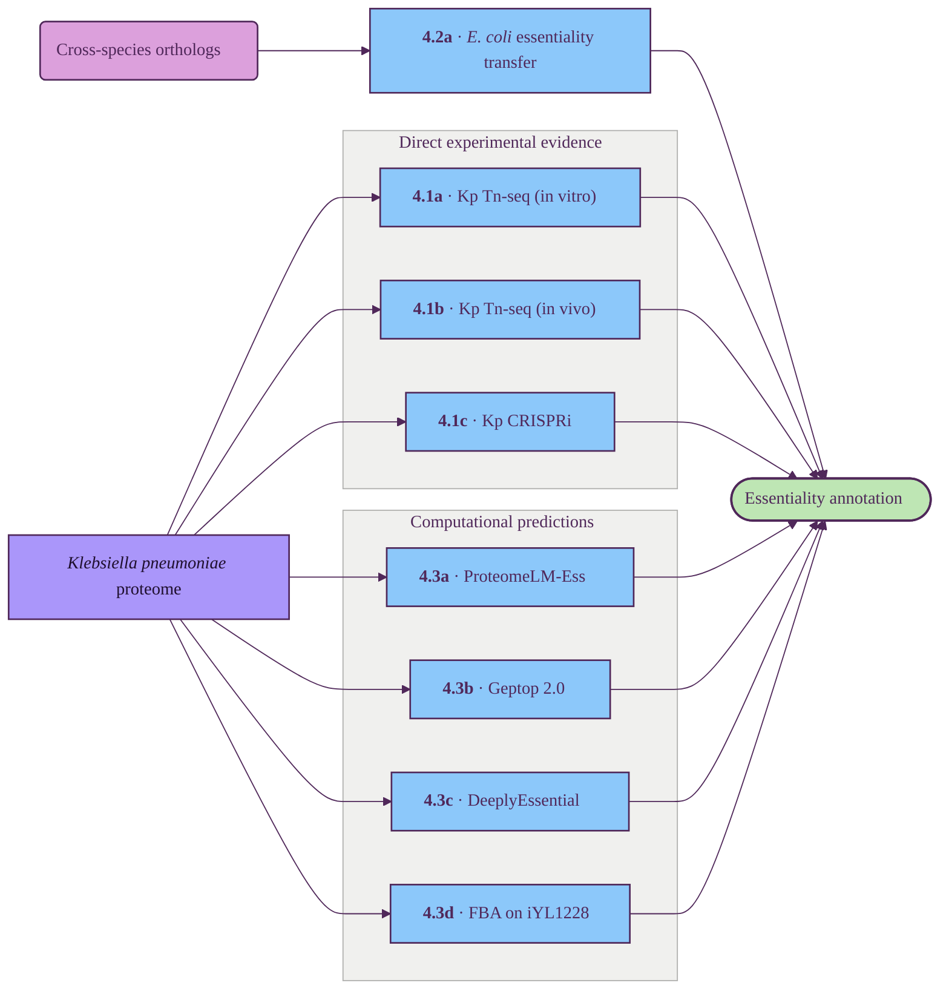

# Essentiality

Determine if the target is required for fitness or survival in Klebsiella pneumoniae.

## Tracks

| ID | Title | Description | Resources |
| --- | --- | --- | --- |
| 4.1a | Kp Tn-seq (in vitro) | Transposon-insertion essentiality in laboratory media (LB) and under antibiotic stress; deepest available Kp essentiality calls. | Short 2024 (ECL8), Cain 2017 (NJST258 ST258) |
| 4.1b | Kp Tn-seq (in vivo) | Fitness in animal infection models — lung, urine, blood, spleen, liver — yielding niche-specific essentiality. | Bachman 2015, Paczosa 2020, Mike & Bachman 2023, Bachman 2025 (all KPPR1) |
| 4.1c | Kp CRISPRi | Mobile-CRISPRi-seq with graded knockdown across ~870 conditionally-essential genes in KPPR1S. | Jana 2023 |
| 4.2a | *E. coli* essentiality transfer | Keio + TraDIS three-way consensus (Keio ∩ PEC ∩ Goodall) lifted onto Kp via ortholog. | Goodall 2018, Keio (Baba 2006) |
| 4.3a | ProteomeLM-Ess | Whole-proteome transformer with supervised essentiality head; LM-based bacterial SOTA, trained on OGEE v3. | Bitbol Lab 2025 |
| 4.3b | Geptop 2.0 | Orthology + phylogeny-based essentiality scoring on a proteome FASTA. | Wen et al. 2019 |
| 4.3c | DeeplyEssential | DNA + protein deep neural network trained on DEG. | Hasan & Lonardi 2020 |
| 4.3d | FBA on iYL1228 | In silico single-gene knockout on a Kp genome-scale metabolic reconstruction. | Liao et al. 2011 |

## Key resources

| Resource | Description | Tracks |
| --- | --- | --- |
| [Short et al. 2024 (eLife)](https://doi.org/10.7554/eLife.88971.3) | ECL8 TraDIS, >554k unique insertions, LB / urine / serum. | 4.1a |
| [Cain et al. 2017 (Sci Rep)](https://www.nature.com/articles/srep42483) | NJST258 "secondary resistome" under colistin / imipenem / ciprofloxacin. | 4.1a |
| [Bachman et al. 2015 (mBio)](https://journals.asm.org/doi/10.1128/mbio.00775-15) | KPPR1 InSeq in C57BL/6 mouse pneumonia. | 4.1b |
| [Paczosa et al. 2020 (IAI)](https://pubmed.ncbi.nlm.nih.gov/31988174/) | KPPR1 lung fitness in WT vs neutropenic hosts. | 4.1b |
| [Mike & Bachman 2023 (PLoS Pathog)](https://pmc.ncbi.nlm.nih.gov/articles/PMC10381055/) | KPPR1 tissue-specific fitness across blood, spleen, liver, lung. | 4.1b |
| [Bachman et al. 2025 (Nat Commun)](https://www.nature.com/articles/s41467-025-56095-3) | KPPR1 bacteremic dissemination Tn-seq. | 4.1b |
| [Jana et al. 2023 (AEM)](https://journals.asm.org/doi/10.1128/aem.00956-23) | Mobile-CRISPRi-seq for conditionally-essential Kp genes. | 4.1c |
| [Goodall et al. 2018 (mBio)](https://journals.asm.org/doi/10.1128/mbio.02096-17) | *E. coli* BW25113 TraDIS + Keio + PEC consensus essential set. | 4.2a |
| [ProteomeLM](https://github.com/Bitbol-Lab/ProteomeLM) | Whole-proteome transformer; `-Ess` head trained on OGEE v3. | 4.3a |
| [Geptop 2.0](http://cefg.uestc.cn/geptop) | Web server + standalone for phylogeny-aware essentiality. | 4.3b |
| [DeeplyEssential](https://github.com/ucrbioinfo/DeeplyEssential) | DNA + protein deep-NN essentiality predictor. | 4.3c |
| [Liao et al. 2011 (iYL1228)](https://pubmed.ncbi.nlm.nih.gov/21478289/) | Genome-scale metabolic reconstruction of *K. pneumoniae* MGH 78578; supports in silico knockouts. | 4.3d |

## Suggestions

- **Graded vulnerability score (new 4.4)** — refit [Jana 2023](https://journals.asm.org/doi/10.1128/aem.00956-23) CRISPRi titration as per-gene vulnerability, à la [Bosch & Rock 2021](https://pmc.ncbi.nlm.nih.gov/articles/PMC8382161/) (max fitness cost, partial-knockdown sensitivity, phenotypic lag). Reanalysis of in-hand data; biggest single shift in target ranking.
- **[Enterobacteriaceae TraDIS compendium](https://pubmed.ncbi.nlm.nih.gov/39207104/)** ([data](https://github.com/Gardner-BinfLab/Enterobacteriaceae-TraDIS)) — 13 TIS libraries across *Escherichia / Salmonella / Klebsiella / Citrobacter / Enterobacter*; upgrades §4.2a from *E. coli*-only to graded consensus.
- **Broad-spectrum vulnerability transfer (new 4.2c)** — pool [Wang / Geisinger 2023](https://pubmed.ncbi.nlm.nih.gov/38126769/) (*A. baumannii* CRISPRi), [Poulsen 2019](https://www.pnas.org/doi/10.1073/pnas.1900570116) (*P. aeruginosa* FiTnEss), [Bosch 2021](https://pmc.ncbi.nlm.nih.gov/articles/PMC8382161/) (*Mtb*) via OrthoDB. Richer than Geptop 2.0's phylogeny score.
- **hvKp Tn-seq in *Galleria*** — [Lin 2025](https://www.frontiersin.org/journals/cellular-and-infection-microbiology/articles/10.3389/fcimb.2025.1643224/full); also [Insua 2021](https://pubmed.ncbi.nlm.nih.gov/33512418/) (MDR cKp). Breaks the KPPR1 monoculture in §4.1b.
- **[OGEE v3](https://academic.oup.com/nar/article/49/D1/D998/5934414) (bacterial subset) + [DEG 15](http://origin.tubic.org/deg/) direct ortholog lookup** — new 4.3e; non-ML baseline that audits ProteomeLM training-set parroting.
- **Synthetic-lethality / redundancy flag (new 4.5)** — informed by [Liu / van Opijnen 2024](https://www.nature.com/articles/s41564-024-01759-x); approximate via [STRING](https://string-db.org/) / KEGG / paralog detection until a Kp dataset exists.
- **Watch-item: [InducTn-seq](https://pubmed.ncbi.nlm.nih.gov/40148565/)** (Christen 2025) — in-vivo Tn-seq bypassing the bottleneck; no Kp dataset yet.
- **Integration framework**: replace vote-counting with weighted ensemble + calibration against the Jana vulnerability score; emit a graded 0–1 vulnerability, not a binary call.
- **§4.1c (Jana CRISPRi)**: change output from "conditionally-essential gene list" to per-gene vulnerability index via depletion-curve refit.
- **§4.2a (*E. coli* lift)**: keep Keio ∩ PEC ∩ Goodall as strict tier, overlay Enterobacteriaceae TraDIS for graded confidence.
- **§4.3a (ProteomeLM-Ess)**: log OGEE training overlap to detect parroting vs generalisation against the new 4.3e direct lookup.

## Implementation (`scripts/07*`)

Run per organism (`--organism {kpneumoniae,ecoli}`). Each track writes a per-protein CSV keyed by
`uniprot_accession`; `07h` merges them into the graded `output/results/<org>/<prefix>_essentiality.csv`
(+ `_shortlist.csv`). Shared helpers in `src/essentiality.py` (reuses `src/ligandability.py`). Full
run log + data versions in `docs/essentiality_log.md`.

| Script | Track | Key output columns |
| --- | --- | --- |
| `07a_fetch_essentiality.py` | data | robust fetcher (publisher CDN → Europe PMC supp zip → NCBI OA tarball → placeholder); stages the Enterobacteriaceae-TraDIS compendium + open papers; writes `fetch_status.tsv` |
| `07b_kp_experimental.py` | 4.1a/b/c | `kp_ess_{in_vitro,urine,serum,in_vivo,vulnerability}_{call,score}`, `kp_ess_sources` (ECL8 + KPPR1 + curated CRISPRi, gene-symbol mapped) |
| `07c_ecoli_transfer.py` | 4.2a + 4.2c | `ec_transfer_essential` (EcoGene 299-gene set via ortholog), `entero_pct_essential`, `bacteria_pct_essential` (graded broad-spectrum) |
| `07d_proteomelm_ess.py` | 4.3a **primary** | `proteomelm_ess_score` — ProteomeLM backbone (over the 01a ESM-C embeddings) + a logistic head we train on the E. coli EcoGene labels (CV AUROC 0.809). `-Ess` head is unreleased upstream. |
| `07e_geptop.py` | 4.3b | `geptop_score`, `geptop_essential` — Geptop 2.0 reimplemented with DIAMOND over the 37 DEG references (cutoff 0.24) |
| `07f_fba_iyl1228.py` | 4.3d | `fba_essential`, `fba_growth_ratio` — cobrapy single-gene deletion (iYL1228 for kp, iML1515 for ec); metabolic subset only |
| `07g_deeplyessential.py` | 4.3c | **deferred** — NaN placeholder (no released weights, py2/TF1.6, license-less) |
| `07h_essentiality_merge.py` | result | `evidence_{experimental,transfer,predictor}`, **`essentiality_score`** [0–1], **`essentiality_tier`** {essential,likely_essential,non_essential}, `experimentally_essential`, `evidence_sources`, `selectivity`. Also `<prefix>_essentiality_shortlist.csv` (broad-selective ∧ essential). |
| `07i/07j/07k_*.py` | — | stylia NPG 2×3 slides: predictor comparison · composite summary · cross-axis landscape (`output/plots/07{i,j,k}_*_{kp,ec}.png`) |
| `07l_publication_essentiality.py` | 4.1/4.2 (experimental-only) | `<prefix>_ess_publications.csv`: `crispri_ce_library`, `crispri_invivo_*`, `kpnih1_essential`, `ecl8_essential`, `pub_ess__<genome>` (×12), `pub_n_species_essential`, `pub_core_essential`, `experimental_essential`. Prediction-free consolidation of published screens (Jana 2023 Mobile-CRISPRi central). |
| `07m_publication_plots.py` | — | dedicated **publications/CRISPRi** slide: screen coverage · CRISPRi in-vivo hits · Kp screen agreement · cross-species conservation · core-essentialome heatmap · CRISPRi-library-by-function (`output/plots/07m_publications_{kp,ec}.png`) |

| `07n_ecoli_experimental.py` | 4.1/4.2 (E. coli, experimental-only) | `ec_ess_experimental.csv`: `ecoli_keio_essential`, `ecoli_goodall_essential`, `ecoli_crispri_{rousset18,wang18}_{log2fc/fitness,essential}`, `ecoli_crispri_multistrain_frac` (Rousset 2021), `ecoli_vulnerability_hawkins`, `ecoli_rbtnseq_min_fitness`, `ecoli_experimental_essential`, `ecoli_vulnerability_score`. Makes E. coli a first-class experimental target (Keio KO, Goodall TraDIS, Rousset/Wang/Cui/Hawkins CRISPRi, RB-TnSeq). |
| `07o_condition_plots.py` | — | condition/stress slide: E. coli antibiotic-conditional essentiality from RB-TnSeq/Fitness Browser (280 conditions); Kp host-niche (ECL8 urine/serum, KPPR1 in-vivo). `output/plots/07o_conditions_{kp,ec}.png` |

**E. coli parity:** E. coli's own screens (07n) feed its `evidence_experimental` (07h 0.40 axis) and
transfer onto Kp via the E. coli ortholog (07c `ec_screens_*_transfer`). The gallery has two equal tabs.
Gated E. coli data (Goodall ASM, Hawkins Cell, Rousset 2021 Springer) fetched via Chrome; only Nichols
2011 (PMC reCAPTCHA) remains un-fetched (optional; redundant with the RB-TnSeq condition matrix).

Jana/Zhu 2023's ASM-gated CRISPRi tables were retrieved via an authenticated Chrome session (the
871-gene Mobile-CRISPRi library + in-vivo KPPR1 screen + the re-tabulated Ramage 2017 KPNIH1 essential
set). Cross-species experimental essentiality is decoded from the Enterobacteriaceae-TraDIS compendium
(numeric TraDIS log-ratio ≤ -0.5 = essential, calibrated against the curated EcoGene set).

**Composite (07h, tunable constants):** `essentiality_score` = renormalised weighted sum over the
*available* sub-scores `0.40·experimental + 0.20·transfer + 0.40·predictor` (missing tracks are dropped
and reweighted, not zero-filled), `predictor` = weighted mean of available predictors (ProteomeLM 0.5 /
Geptop 0.3 / FBA 0.2). **Tiers are evidence-driven:** `essential` if a direct Kp essential call, or a
strong predictor+transfer consensus, or score ≥ 0.60; `likely_essential` if score ≥ 0.35 or any partial
signal; else `non_essential`.

**Data resources (eosvc, gitignored):** Enterobacteriaceae-TraDIS compendium, ECL8/KPPR1 supp tables,
Geptop reference `.rar`, BiGG models — under `data/raw/{kpneumoniae,ecoli,other}/essentiality/`.
