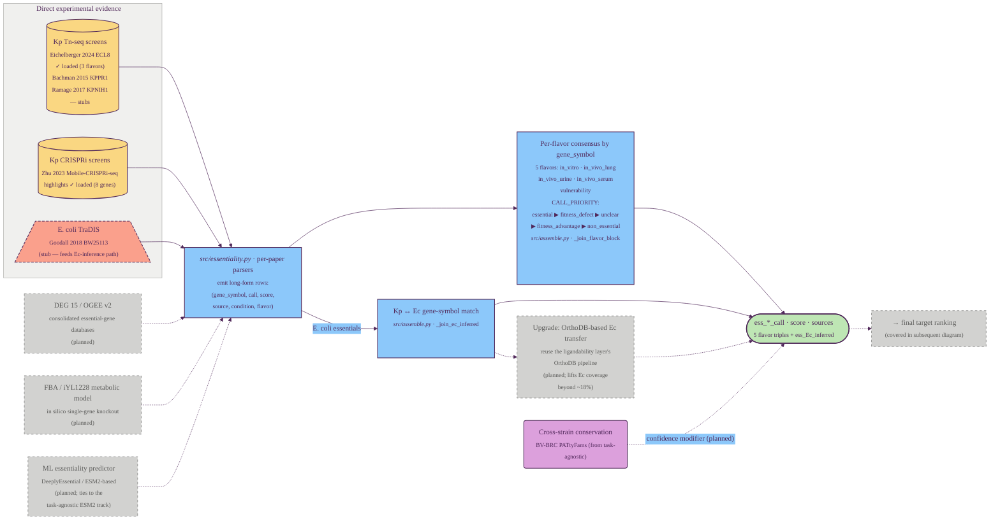

# Essentiality / vulnerability assessment

Part 4 of the GraDi target-prioritization pipeline. See
[`pipeline.md`](./pipeline.md) for the index and the diagram style legend.

Essentiality asks "is this target required for fitness or survival?";
vulnerability sharpens it by asking "how much depletion is tolerated?" via
graded CRISPRi knockdown. The layer combines two evidence pathways — direct
*K. pneumoniae* measurements (Tn-seq, CRISPRi) and *E. coli* ortholog
inference — into a per-condition consensus call. It is the most data-source-
heavy axis: several papers contribute, with a mix of "data loaded today",
"parser written but file not staged" stubs, and several "explore more"
extensions worth flagging.

## Tracks

| Track | Source(s) | Condition / flavor | Status | Output columns |
| --- | --- | --- | --- | --- |
| Kp Tn-seq (in vitro) | Eichelberger 2024 ECL8; Ramage 2017 KPNIH1 (stub) | `in_vitro_essential` | loaded + stub | `ess_in_vitro_*` |
| Kp Tn-seq (in vivo lung) | Bachman 2015 KPPR1 (stub) | `in_vivo_lung` | stub | `ess_in_vivo_lung_*` |
| Kp Tn-seq (in vivo urine) | Eichelberger 2024 | `in_vivo_urine` | loaded | `ess_in_vivo_urine_*` |
| Kp Tn-seq (in vivo serum) | Eichelberger 2024 | `in_vivo_serum` | loaded | `ess_in_vivo_serum_*` |
| Kp CRISPRi vulnerability | Zhu 2023 (highlights) | `vulnerability_crispri` | loaded (8 genes) | `ess_vulnerability_*` |
| E. coli ortholog inference | Goodall 2018 (stub) → `_join_ec_inferred` | `in_vitro_essential_Ec` | stub | `ess_Ec_inferred_call/via/sources` |
| DEG / OGEE consolidated DBs | DEG 15, OGEE v2 | cross-validation | _planned_ | _planned_ |
| FBA in silico knockout | iYL1228 (or newer) | computational | _planned_ | _planned_ |
| ML essentiality predictor | DeeplyEssential / ESM2-based | computational | _planned_ | _planned_ |
| OrthoDB-based Ec transfer | OrthoDB groups (from ligandability layer) | upgrade of `_join_ec_inferred` | _planned_ | replaces `via=gene-symbol match` |

Two architectural notes:

- **Consensus priority is intentional.** `CALL_PRIORITY`
  (`essential > fitness_defect > unclear > fitness_advantage > non_essential`)
  means a single "essential" call wins over any number of weaker calls. This
  is deliberately optimistic: a target seen as essential under one condition
  by one source is flagged, even if other conditions disagree — the
  downstream final-ranking step is responsible for weighting per-condition
  specificity.
- **The Ec-inference path uses simple symbol matching today.**
  `_join_ec_inferred` does a lowercase gene-symbol intersection between Kp
  `kp_gene_symbol` and the E. coli essentiality table. Since only ~18% of
  HS11286 entries carry a canonical gene symbol, an OrthoDB-based upgrade
  (reusing the [ligandability layer's](./02_ligandability.md) pipeline) is
  queued as the highest-leverage extension here.

---

**Prev:** [Degradability assessment](./03_degradability.md) ·
[Task-agnostic per-protein annotation](./01_task_agnostic.md) ·
[Ligandability assessment](./02_ligandability.md)
