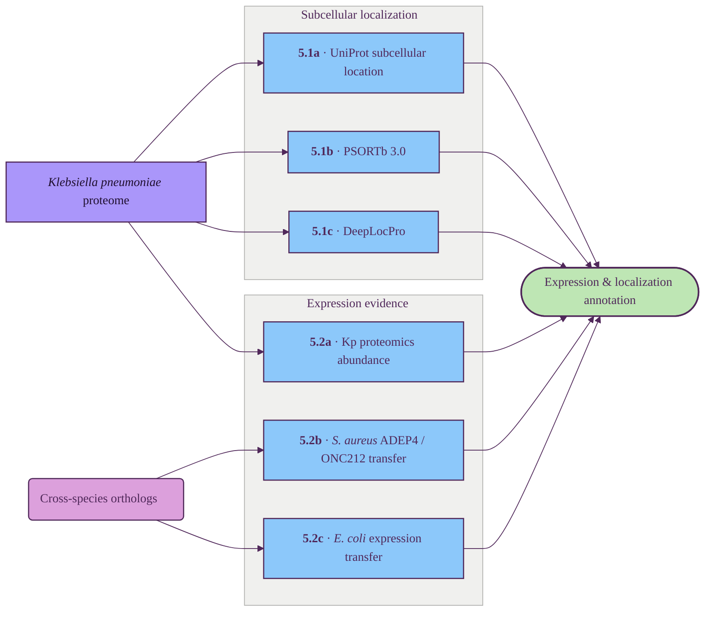

# Expression and localization

Evaluates if the target is present in meaningful amounts and physically reachable by the cytoplasmic Clp machinery.

## Tracks

| ID | Title | Description | Resources |
| --- | --- | --- | --- |
| 5.1a | UniProt subcellular location | Curated localization labels where available. | UniProt |
| 5.1b | PSORTb 3.0 | Rule-based prokaryotic localization predictor (Gram-aware). | PSORTb |
| 5.1c | DeepLocPro | ML-based prokaryotic localization predictor. | DeepLocPro |
| 5.2a | Kp proteomics abundance | Per-protein abundance from PaxDb / public Kp datasets. | PaxDb |
| 5.2b | *S. aureus* ADEP4 / ONC212 transfer | Clp-activator proteomics from *S. aureus*, transferred via ortholog match — empirical Clp-accessibility readout. | OrthoDB, published proteomics |
| 5.2c | *E. coli* expression transfer | *E. coli* abundance lifted onto Kp via OrthoDB. | PaxDb, OrthoDB |

## Key resources

| Resource | Description | Tracks |
| --- | --- | --- |
| [PSORTb](https://www.psort.org/psortb/) | Gold-standard rule-based prokaryotic subcellular-localization predictor. | 5.1b |
| [DeepLocPro](https://services.healthtech.dtu.dk/services/DeepLocPro-1.0/) | Deep-learning subcellular-localization predictor for prokaryotes. | 5.1c |
| [PaxDb](https://pax-db.org/) | Integrated absolute-abundance proteomics across organisms. | 5.2a, 5.2c |
