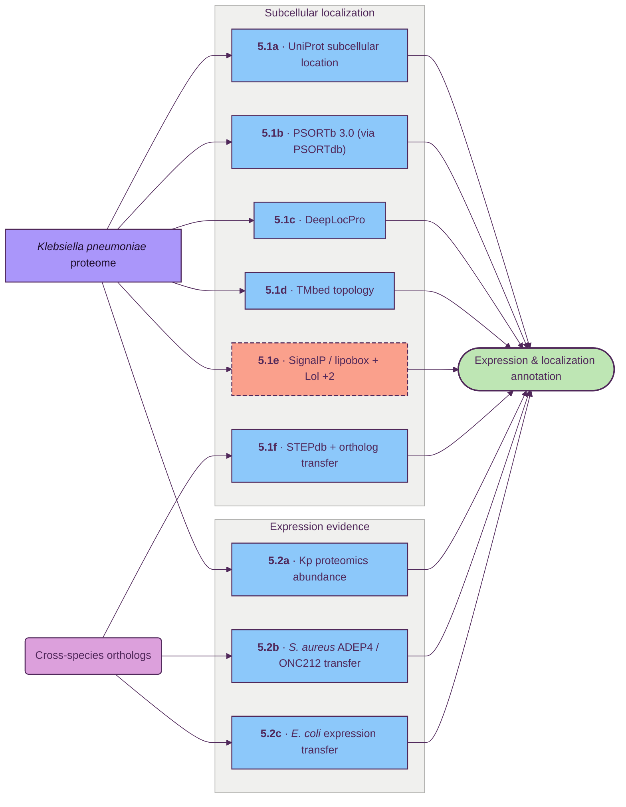

# Expression and localization

Evaluates if the target is present in meaningful amounts and physically reachable by the cytoplasmic Clp machinery.

```mermaid
%%{init: {'theme':'base','themeVariables':{'primaryColor':'#FAD782','primaryBorderColor':'#50285A','primaryTextColor':'#50285A','lineColor':'#50285A','secondaryColor':'#8CC8FA','tertiaryColor':'#BEE6B4','clusterBkg':'#F0F0EE','clusterBorder':'#B0B0AE','titleColor':'#50285A','fontFamily':'Inter, system-ui, sans-serif'}}}%%
flowchart LR
    classDef source    fill:#AA96FA,stroke:#50285A,stroke-width:1.5px,color:#1F0F2E
    classDef dataset   fill:#FAD782,stroke:#50285A,stroke-width:1.5px,color:#50285A
    classDef method    fill:#8CC8FA,stroke:#50285A,stroke-width:1.5px,color:#50285A
    classDef embedding fill:#AA96FA,stroke:#50285A,stroke-width:1.5px,color:#1F0F2E
    classDef result    fill:#BEE6B4,stroke:#50285A,stroke-width:2px,color:#50285A
    classDef tagnostic fill:#DCA0DC,stroke:#50285A,stroke-width:1.5px,color:#50285A
    classDef stub      fill:#FAA08C,stroke:#50285A,stroke-width:1.5px,stroke-dasharray:6 3,color:#50285A
    classDef planned   fill:#D2D2D0,stroke:#7A7A78,stroke-width:1px,stroke-dasharray:5 5,color:#5A5A58

    P["<i>Klebsiella pneumoniae</i> proteome"]:::source

    ORTHO("Cross-species orthologs"):::tagnostic

    subgraph LOC [" Subcellular localization "]
        direction LR
        UPLOC["<b>5.1a</b> · UniProt subcellular location"]:::method
        PSORT["<b>5.1b</b> · PSORTb 3.0 (via PSORTdb)"]:::method
        DLP["<b>5.1c</b> · DeepLocPro"]:::method
        TMB["<b>5.1d</b> · TMbed topology"]:::method
        SP["<b>5.1e</b> · SignalP / lipobox + Lol +2"]:::stub
        STEP["<b>5.1f</b> · STEPdb + ortholog transfer"]:::method
    end

    subgraph EXPR [" Expression evidence "]
        direction LR
        PAXKP["<b>5.2a</b> · Kp proteomics abundance"]:::method
        SAU["<b>5.2b</b> · <i>S. aureus</i> ADEP4 / ONC212 transfer"]:::method
        ECEXP["<b>5.2c</b> · <i>E. coli</i> expression transfer"]:::method
    end

    P --> UPLOC
    P --> PSORT
    P --> DLP
    P --> TMB
    P --> SP
    P --> PAXKP
    ORTHO --> STEP
    ORTHO --> SAU
    ORTHO --> ECEXP

    UPLOC --> T(["Expression &amp; localization annotation"]):::result
    PSORT --> T
    DLP   --> T
    TMB   --> T
    SP    --> T
    STEP  --> T
    PAXKP --> T
    SAU   --> T
    ECEXP --> T
```

## Tracks

Status: **§5.1 is implemented** (`scripts/09a`–`09h`, `src/localization.py`, run log in
`docs/localization_log.md`) at 100% coverage for both organisms. §5.2 is still spec-only.

| ID | Title | Description | Resources | Status |
| --- | --- | --- | --- | --- |
| 5.1a | UniProt subcellular location | Curated labels, split into experimental (ECO) vs curated-by-similarity; also lipid anchors. | UniProt | ✅ `09a` |
| 5.1b | PSORTb 3.0 | Rule-based prokaryotic predictor, taken **precomputed from PSORTdb** rather than run locally. | PSORTdb | ✅ `09b` |
| 5.1c | DeepLocPro | ML prokaryotic predictor (ESM-2); the primary predictor for the axis. | DeepLocPro | ✅ `09c` |
| 5.1d | TMbed topology | Per-residue TM topology: β-barrel call + cytoplasm-facing residue fraction. | TMbed | ✅ `09d` (133 β-barrels) |
| 5.1e | Signal-peptide typing | Sec/SPII lipoprotein call + Lol "+2 rule" sorting. | SignalP 6.0 (licensed) / lipobox fallback | ⚠️ `09e` — fallback active, SignalP not installed |
| 5.1f | Experimental transfer | STEPdb 2.0 for *E. coli*, carried onto Kp by orthology. | STEPdb, OrthoFinder | ✅ `09f` |
| 5.2a | Kp proteomics abundance | Per-protein abundance from PaxDb / public Kp datasets. | PaxDb | ⬜ spec only |
| 5.2b | *S. aureus* ADEP4 / ONC212 transfer | Clp-activator proteomics from *S. aureus*, transferred via ortholog match — empirical Clp-accessibility readout. | OrthoDB, published proteomics | ⬜ spec only |
| 5.2c | *E. coli* expression transfer | *E. coli* abundance lifted onto Kp via OrthoDB. | PaxDb, OrthoDB | ⬜ spec only |

## Key resources

| Resource | Description | Tracks |
| --- | --- | --- |
| [PSORTb](https://www.psort.org/psortb/) / [PSORTdb](https://db.psort.org/) | Rule-based prokaryotic localization predictor; PSORTdb serves its results precomputed per RefSeq genome. | 5.1b |
| [DeepLocPro](https://services.healthtech.dtu.dk/services/DeepLocPro-1.0/) | Deep-learning (ESM-2) subcellular-localization predictor for prokaryotes. | 5.1c |
| [TMbed](https://github.com/BernhoferM/TMbed) | Per-residue TM topology (α-helix, β-barrel, signal peptide, inside/outside) from ProtT5 embeddings. | 5.1d |
| [STEPdb](http://stepdb.eu/) | Curated subcellular topology of the *E. coli* proteome, 13 classes, literature-backed. | 5.1f |
| [PaxDb](https://pax-db.org/) | Integrated absolute-abundance proteomics across organisms. | 5.2a, 5.2c |

## Suggestions

- ~~**DeepTMHMM** — new 5.1d~~ → **done as 5.1d**, but with [TMbed](https://github.com/BernhoferM/TMbed) instead: same per-residue α-helix + β-barrel + signal-peptide output, Apache-2.0 and `pip`-installable, whereas DeepTMHMM ships only through BioLib (Docker or a cloud round-trip).
- **[SignalP 6.0](https://services.healthtech.dtu.dk/services/SignalP-6.0/) + [LipoP](https://services.healthtech.dtu.dk/services/LipoP-1.0/)** — **partly done as 5.1e**. The Lol "+2 rule" sorting is implemented; SignalP itself is licensed and not installed, so `09e` currently runs a calibrated lipobox fallback (P 0.74 / R 0.82) and does not type Tat/SPIII. Set `SIGNALP6_BIN` to upgrade.
- **Structure-derived surface exposure (new 5.3)** — [DSSP](https://swift.cmbi.umcn.nl/gv/dssp/) / SASA on AlphaFold; AF2 RSA ~0.815 ρ to native ([pocketome universe 2025](https://www.cell.com/cell/fulltext/S0092-8674(22)00593-1)).
- **Condition-specific Kp expression (new 5.2d)** — curated [PRIDE](https://www.ebi.ac.uk/pride/) datasets ([PXD047744](https://www.ebi.ac.uk/pride/archive/projects/PXD047744)), colistin / meropenem / serum-stress proteomics, lung ([Bachman 2015](https://journals.asm.org/doi/10.1128/mbio.00775-15)) and urine+serum ([Short 2024](https://elifesciences.org/articles/88971)) Tn-seq fitness. PaxDb misses niche-expressed targets.
- **[PRED-TMBB2](https://academic.oup.com/bioinformatics/article/32/17/i665/2450774) β-barrel cross-check** — sibling to 5.1d; β-barrel mis-call as cytoplasmic is the worst-case error.
- **Mtb cyclomarin / ecumicin + B. subtilis ADEP proteomics → §5.2b** — closer to BacPROTAC than ADEP4 (recruits ClpC). [Front Chem 2024 BacPROTAC Gram-negative review](https://www.frontiersin.org/journals/chemistry/articles/10.3389/fchem.2024.1358539/full).
- ~~**§5.1b PSORTb**: cross-check the lipoprotein call with SignalP 6.0 + LipoP.~~ → **done in `09g`**: the Lol "+2 rule" and the TMbed β-barrel call may overrule a *predicted* localization (never an experimental or curated one).
- ~~**Sink: explicit Clp-accessibility score**~~ → **done in `src/localization.py:clp_accessibility`**, exactly as specified: cytoplasmic 1.0 / IM with ≥30% cyto-domain 0.6 / IM-mostly-buried 0.2 / periplasmic-soluble 0.2 / OM-lipo / β-barrel / extracellular 0.0 (0.4 when TMbed topology is missing).
- **§5.2 normalisation: harmonise on [iBAQ](https://www.nature.com/articles/nature10098)** before ortholog lift; tag per-organism evidence quality.
- **Architectural: split the §5 sink** into target-side Clp-accessibility vs compound-side recruiter delivery ([eNTRy rules](https://www.nature.com/articles/nature22308), porins, efflux).
