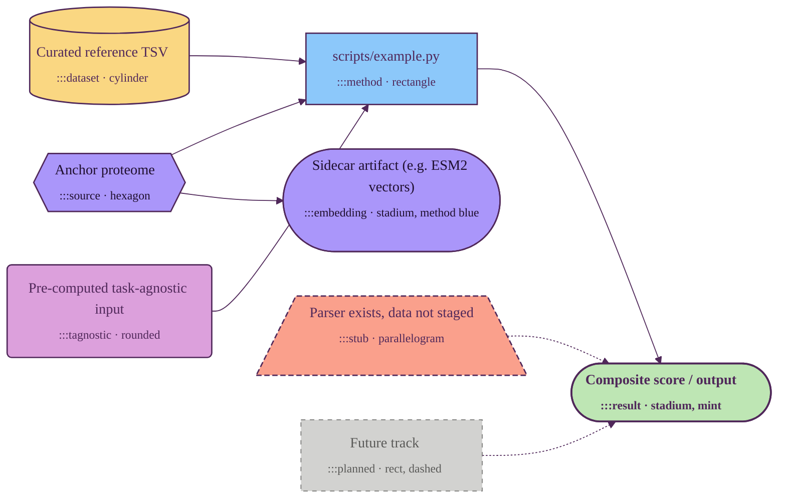

# Mermaid diagram style (Ersilia palette)

Canonical style for Mermaid flowcharts in this repository. Anchored on the
official Ersilia brand palette (`ErsiliaColors` from
[ersilia-os/stylia](https://github.com/ersilia-os/stylia)).

Every Mermaid block in `docs/` should start with the header in §2, use the
shape that matches the node's class (§1, "Shape" column), and apply the
matching `:::class` annotation.

---

## 1. Palette + shape → semantic role

Each class is encoded twice — by **fill color** *and* by **node shape** —
so the diagram reads even when colors are stripped (slide handouts, b/w
print, screen-reader summary). Plum is reserved for borders and text;
never used as a fill, matching stylia's "ersilia" matplotlib style
("structural elements in plum").

| Class | Shape | Mermaid syntax | Ersilia color | Hex | What it represents |
|---|---|---|---|---|---|
| `:::source` | hexagon | `id{{"text"}}` | purple | `#AA96FA` | Anchor proteome / starting entity (one per diagram). "Entry point." |
| `:::dataset` | cylinder | `id[("text")]` | yellow | `#FAD782` | Curated reference data file (Flynn 2003, Nagar 2021, ChEMBL export, …). "Data on disk." |
| `:::tagnostic` | rounded rect | `id("text")` | pink | `#DCA0DC` | Pre-computed input reused across pipelines (from the task-agnostic layer). "Reusable input." |
| `:::method` | rectangle | `id["text"]` | blue | `#8CC8FA` | Script / compute step (typically a `scripts/*.py` or `src/*.py` invocation). "Process." |
| `:::embedding` | stadium (pill) | `id(["text"])` | purple | `#AA96FA` | Sidecar / standalone artifact (e.g. ESM2 vector store) — a per-protein output produced by a compute step but **not joined** into the main annotation table. Shares the source fill (it derives from the proteome) but uses the stadium shape (it *is* an endpoint). |
| `:::result` | stadium (pill) | `id(["text"])` | mint | `#BEE6B4` | Output, score, sink. Bold text + thicker border. "Terminator." |
| `:::stub` | parallelogram | `id[/"text"\]` | orange | `#FAA08C` | Parser exists in code, data file not yet staged. Dashed border. "In-progress." |
| `:::planned` | rectangle, dashed | `id["text"]` | gray | `#D2D2D0` | Not yet implemented. Dashed border + muted text. "Future." |
| (structural) | — | — | plum | `#50285A` | Borders, arrows, and text on light fills |
| (cluster bg) | — | — | light gray | `#F0F0EE` | `subgraph` container background (lighter than `:::planned` so nested planned nodes still read) |

**Default orientation is `flowchart LR`** (left-to-right). Slide aspect
ratios are landscape; TD diagrams grow too tall to fit on a 16:9 slide
once they pass ~6 nodes. Use `flowchart TD` only when the diagram is
genuinely a waterfall with no horizontal alternative.

**Inside every `subgraph`, set `direction LR` on the first line.** The
outer `flowchart LR` does not propagate to subgraph internals — members
of a subgraph default to vertical stacking, which can make an LR diagram
read as a column of stacked towers. Adding `direction LR` as the
subgraph's first statement keeps the layout horizontal end-to-end.

## 2. Copy-pastable header

Start every Mermaid block with this exact preamble:

````markdown
```mermaid
%%{init: {'theme':'base','themeVariables':{'primaryColor':'#FAD782','primaryBorderColor':'#50285A','primaryTextColor':'#50285A','lineColor':'#50285A','secondaryColor':'#8CC8FA','tertiaryColor':'#BEE6B4','clusterBkg':'#F0F0EE','clusterBorder':'#B0B0AE','titleColor':'#50285A','fontFamily':'Inter, system-ui, sans-serif'}}}%%
flowchart LR
    classDef source    fill:#AA96FA,stroke:#50285A,stroke-width:1.5px,color:#1F0F2E
    classDef dataset   fill:#FAD782,stroke:#50285A,stroke-width:1.5px,color:#50285A
    classDef method    fill:#8CC8FA,stroke:#50285A,stroke-width:1.5px,color:#50285A
    classDef embedding fill:#AA96FA,stroke:#50285A,stroke-width:1.5px,color:#1F0F2E
    classDef result    fill:#BEE6B4,stroke:#50285A,stroke-width:2px,color:#50285A,font-weight:bold
    classDef tagnostic fill:#DCA0DC,stroke:#50285A,stroke-width:1.5px,color:#50285A
    classDef stub      fill:#FAA08C,stroke:#50285A,stroke-width:1.5px,stroke-dasharray:6 3,color:#50285A
    classDef planned   fill:#D2D2D0,stroke:#7A7A78,stroke-width:1px,stroke-dasharray:5 5,color:#5A5A58

    %% your nodes + edges here, using the shapes in §1
```
````

## 3. Worked example

All seven classes side by side, using both color and shape:



## 4. How to apply a class and a shape

One class per node, and the shape must match the class's row in §1. Examples
drawn from the existing pipeline diagrams:

- *Flynn 2003 ClpXP/ClpAP trap census* → `DS[("Flynn 2003 …")]:::dataset` (cylinder, yellow).
- *Nagar 2021 E. coli half-lives* → `NAGAR[("Nagar 2021 …")]:::dataset`.
- *scripts/03_annotate_clp_degradability.py* → `M["scripts/03_…"]:::method` (rectangle, blue).
- *Composite `clp_degradability_score` → tier* → `R(["Composite score …"]):::result` (stadium, mint, bold).
- *Structures (PDB + AlphaFold) — from task-agnostic layer* → `TA("Structures …"):::tagnostic` (rounded, pink).
- *UniProt reference proteome UP000007841* → `SRC{{"UniProt …"}}:::source` (hexagon, purple).
- *ESM2-based degradability ML (planned)* → `ML["ESM2 …"]:::planned` (rect dashed, gray).
- *ClpK paralog handling (parser stub)* → `CLPK[/"ClpK …"\]:::stub` (parallelogram dashed, orange).
- *ESM2 embeddings (standalone vector store)* → `ESM2(["ESM2 …"]):::embedding` (stadium, method blue) — same color as method but stadium shape signals it's a sidecar artifact, not a column joined into the main table.

Edges follow the default plum line color; mark planned/stub edges with `-.->`
(dotted) and implemented edges with `-->` (solid). The class on the *node*
carries the implementation status — the edge style just echoes it.

## 5. Don'ts

- **Don't mismatch shape and class.** A dataset that's drawn as a rectangle
  loses half the visual signal. The shape encodes role even when the diagram
  is monochrome — keep the §1 mapping strict.
- **Don't use raw hex inside a node.** All color comes from the seven
  `classDef`s in the header. If you need a new visual category, add a class
  to this style guide first; don't fork one off in a single diagram.
- **Don't use plum as a fill.** It's the only color reserved as structural
  (borders, arrows, text). Filling a node with plum needs white text and
  collides with the diagram's outline — keep it strictly structural.
- **Don't leave default-styled (white) nodes** in a finished diagram. Every
  non-trivial node should pick one of the seven classes.
- **Don't double-class** (`:::method :::result`). Pick the dominant role and
  put nuance in the node label's `<sub>…</sub>` text.
- **Don't override `themeVariables`** in individual diagrams. The header in
  §2 is fixed; if it needs to change, change it here and migrate everything.
- **Don't reuse `:::sink`, `:::ref`, or other legacy class names** from
  pre-style-guide diagrams — they were collapsed into the seven canonical
  classes above.
- **Don't default to `flowchart TD` for new diagrams.** LR is the default
  because every diagram in this repo eventually ends up on a 16:9 slide.
