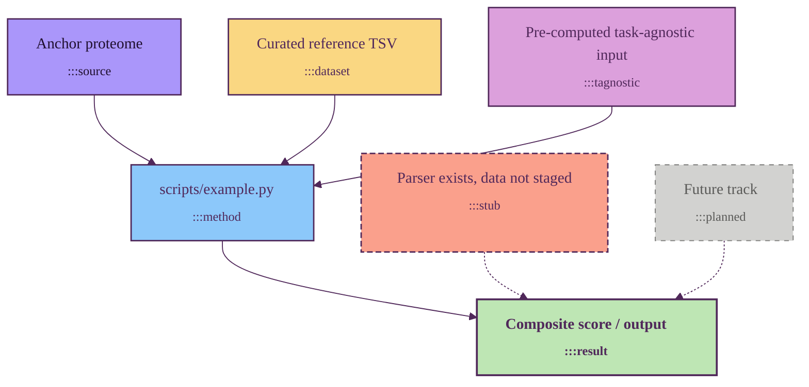

# Mermaid diagram style (Ersilia palette)

Canonical style for Mermaid flowcharts in this repository. Anchored on the
official Ersilia brand palette (`ErsiliaColors` from
[ersilia-os/stylia](https://github.com/ersilia-os/stylia)).

Every Mermaid block in `docs/` should start with the header in §2 and apply
one of the seven classes in §1 to each non-trivial node.

---

## 1. Palette → semantic role

Seven node classes plus one structural color. Plum is reserved for borders
and text — never used as a fill, matching stylia's "ersilia" matplotlib
style ("structural elements in plum").

| Class | Ersilia color | Hex | What it represents |
|---|---|---|---|
| `:::source` | purple | `#AA96FA` | Anchor proteome / starting entity (one per diagram) |
| `:::dataset` | yellow | `#FAD782` | Curated reference data file (Flynn 2003, Nagar 2021, ChEMBL export, …) |
| `:::method` | blue | `#8CC8FA` | Script / compute step (typically a `scripts/*.py` or `src/*.py` invocation) |
| `:::result` | mint | `#BEE6B4` | Output, score, sink. Bold + thicker border. |
| `:::tagnostic` | pink | `#DCA0DC` | Pre-computed input reused across pipelines (from the task-agnostic layer) |
| `:::stub` | orange | `#FAA08C` | Parser exists in code, data file not yet staged. Dashed border. |
| `:::planned` | gray | `#D2D2D0` | Not yet implemented. Dashed border + muted text. |
| (structural) | plum | `#50285A` | Borders, arrows, and text on light fills |

## 2. Copy-pastable header

Start every Mermaid block with this exact preamble (replace `flowchart TD`
with `flowchart LR` if the diagram reads better horizontally — everything
else stays):

````markdown
```mermaid
%%{init: {'theme':'base','themeVariables':{'primaryColor':'#FAD782','primaryBorderColor':'#50285A','primaryTextColor':'#50285A','lineColor':'#50285A','secondaryColor':'#8CC8FA','tertiaryColor':'#BEE6B4','fontFamily':'Inter, system-ui, sans-serif'}}}%%
flowchart TD
    classDef source    fill:#AA96FA,stroke:#50285A,stroke-width:1.5px,color:#1F0F2E
    classDef dataset   fill:#FAD782,stroke:#50285A,stroke-width:1.5px,color:#50285A
    classDef method    fill:#8CC8FA,stroke:#50285A,stroke-width:1.5px,color:#50285A
    classDef result    fill:#BEE6B4,stroke:#50285A,stroke-width:2px,color:#50285A,font-weight:bold
    classDef tagnostic fill:#DCA0DC,stroke:#50285A,stroke-width:1.5px,color:#50285A
    classDef stub      fill:#FAA08C,stroke:#50285A,stroke-width:1.5px,stroke-dasharray:6 3,color:#50285A
    classDef planned   fill:#D2D2D0,stroke:#7A7A78,stroke-width:1px,stroke-dasharray:5 5,color:#5A5A58

    %% your nodes + edges here
```
````

## 3. Worked example

All seven classes side by side:



## 4. How to apply a class

One class per node. Pick the one whose description in §1 best fits the node's
role. Examples drawn from `docs/pipeline.md`:

- *Flynn 2003 ClpXP/ClpAP trap census* → `:::dataset` (curated reference TSV).
- *Nagar 2021 E. coli half-lives* → `:::dataset`.
- *scripts/03_annotate_clp_degradability.py* → `:::method`.
- *Composite `clp_degradability_score` → tier* → `:::result`.
- *Structures (PDB + AlphaFold) — from task-agnostic layer* → `:::tagnostic`.
- *UniProt reference proteome UP000007841* → `:::source`.
- *ESM2-based degradability ML (planned)* → `:::planned`.
- *ClpK paralog handling (parser stub)* → `:::stub`.

Edges follow the default plum line color; mark planned/stub edges with `-.->`
(dotted) and implemented edges with `-->` (solid). The class on the *node*
carries the implementation status — the edge style just echoes it.

## 5. Don'ts

- **Don't use raw hex inside a node.** All color comes from the seven
  `classDef`s in the header. If you need a new visual category, add a class
  to this style guide first; don't fork one off in a single diagram.
- **Don't use plum as a fill.** It's the only color reserved as structural
  (borders, arrows, text). Filling a node with plum needs white text and
  collides with the diagram's outline — keep it strictly structural.
- **Don't leave default-styled (white) nodes** in a finished diagram. Every
  non-trivial node should pick one of the seven classes.
- **Don't double-class** (`:::method :::result`). Pick the dominant role and
  put nuance in the node label's `<sub>…</sub>` text.
- **Don't override `themeVariables`** in individual diagrams. The header in
  §2 is fixed; if it needs to change, change it here and migrate everything.
- **Don't reuse `:::sink`, `:::ref`, or other legacy class names** from
  pre-style-guide diagrams — they were collapsed into the seven canonical
  classes above.
