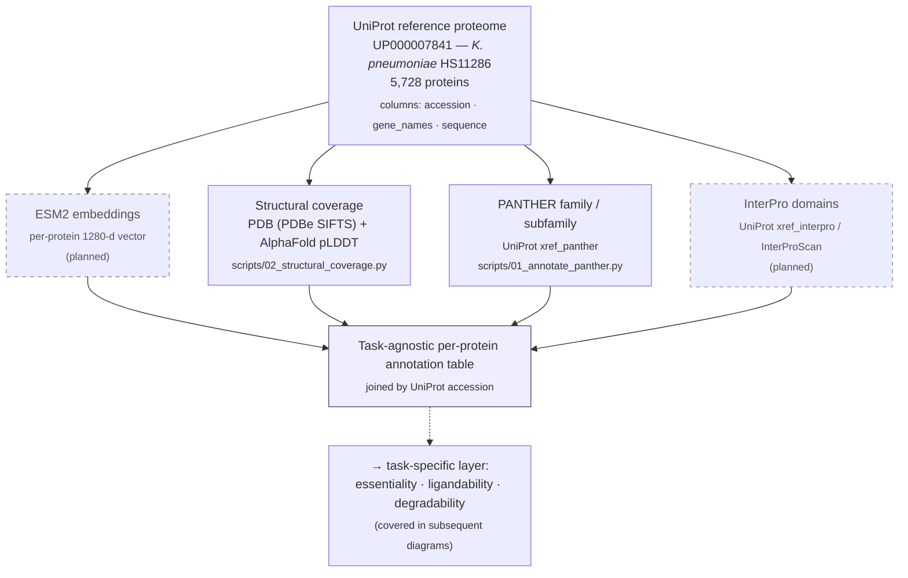

# Pipeline overview

Diagrams describing the GraDi target-prioritization pipeline.

Subsequent sections (essentiality / ligandability / degradability scoring, and
final ranking) will be added as the corresponding workstreams come online.

**Legend.** Dashed boxes denote annotations that are planned but not yet
implemented in this repository.

---

## 1. Task-agnostic per-protein annotation

This layer produces per-protein evidence that is independent of the downstream
prioritization axes. Each track below runs once per reference proteome and
writes a TSV under `data/processed/` keyed by UniProt accession; the four
outputs are joined on accession to form the task-agnostic annotation table
that all task-specific scorers consume.

### Tracks

| Track | Input | Resource | Script | Output |
| --- | --- | --- | --- | --- |
| ESM2 embeddings | sequence | ESM2-650M (1280-d) | _planned_ | _planned_ |
| Structural coverage | accession | PDBe SIFTS, AlphaFold DB | `scripts/02_structural_coverage.py` | `data/processed/<slug>_structural_coverage.tsv` |
| PANTHER family / subfamily | UniProt xref | PANTHER HMM library | `scripts/01_annotate_panther.py` | `data/processed/<slug>_panther.tsv` |
| InterPro domains | UniProt xref / sequence | InterPro / InterProScan | _planned_ | _planned_ |

The reference proteome itself is produced by `scripts/00_download_proteome.py`
(UniProt stream API → `data/raw/<slug>_proteome.tsv`).
