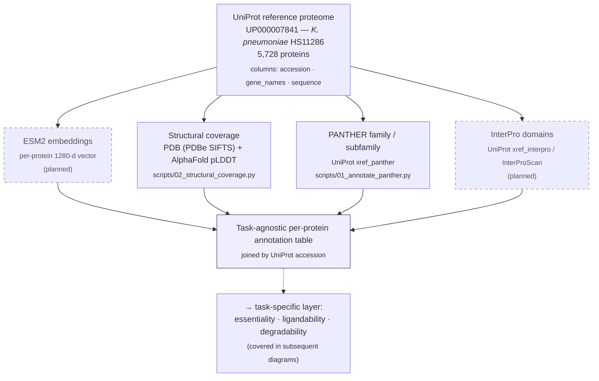
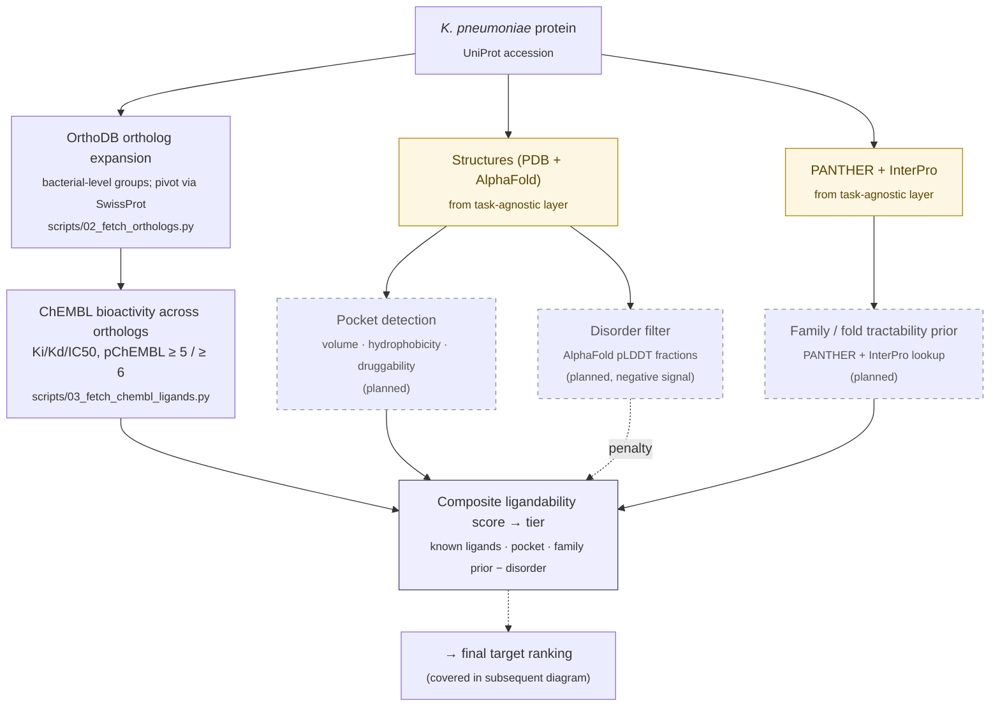
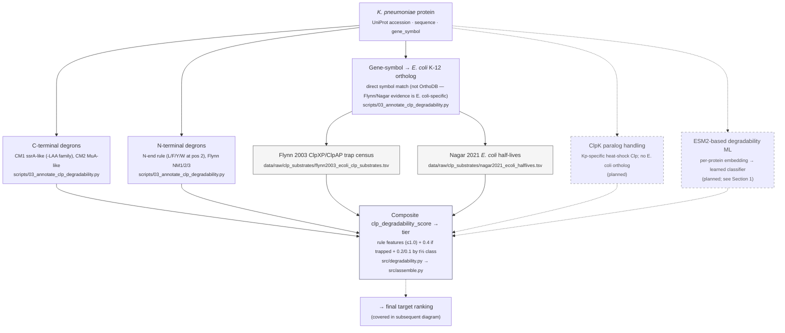

# Pipeline overview

Diagrams describing the GraDi target-prioritization pipeline.

Subsequent sections (essentiality, degradability scoring, and final ranking)
will be added as the corresponding workstreams come online.

**Legend.**
- Solid boxes denote tracks implemented in this repository.
- Dashed boxes denote planned tracks not yet implemented.
- Tan-filled boxes denote inputs pre-computed by the task-agnostic layer
  of Section 1.
- Light-grey boxes denote curated reference data files committed under
  `data/raw/` (e.g. Flynn 2003, Nagar 2021).

---

## 1. Task-agnostic per-protein annotation

This layer produces per-protein evidence that is independent of the downstream
prioritization axes. Each track below runs once per reference proteome and
writes a TSV under `data/processed/` keyed by UniProt accession; the four
outputs are joined on accession to form the task-agnostic annotation table
that all task-specific scorers consume.

### Tracks

| Track | Input | Resource | Script | Output |
| --- | --- | --- | --- | --- |
| ESM2 embeddings | sequence | ESM2-650M (1280-d) | _planned_ | _planned_ |
| Structural coverage | accession | PDBe SIFTS, AlphaFold DB | `scripts/02_structural_coverage.py` | `data/processed/<slug>_structural_coverage.tsv` |
| PANTHER family / subfamily | UniProt xref | PANTHER HMM library | `scripts/01_annotate_panther.py` | `data/processed/<slug>_panther.tsv` |
| InterPro domains | UniProt xref / sequence | InterPro / InterProScan | _planned_ | _planned_ |

The reference proteome itself is produced by `scripts/00_download_proteome.py`
(UniProt stream API → `data/raw/<slug>_proteome.tsv`).

---

## 2. Ligandability assessment

Ligandability asks whether a small-molecule recruiter could engage the target —
the key tractability question for BacPROTAC discovery. We combine three
positive signals — known ligands transferred from bacterial orthologs (the
lift, since *K. pneumoniae* itself has almost no direct ChEMBL coverage),
structure-based pocket druggability, and a family/fold prior — with one
negative signal — predicted disorder.

### Tracks

| Track | Input | Resource | Script | Output |
| --- | --- | --- | --- | --- |
| OrthoDB ortholog expansion | gene symbol | OrthoDB via UniProt (SwissProt pivot) | `scripts/02_fetch_orthologs.py` | `data/processed/klebsiella_pneumoniae_orthodb_orthologs.tsv` |
| ChEMBL bioactivity | UniProt + orthologs | ChEMBL REST (`/target`, `/activity`) | `scripts/03_fetch_chembl_ligands.py` | `data/processed/chembl_ligand_counts.tsv` |
| Pocket detection | AlphaFold / PDB structure | _tool TBD_ | _planned_ | _planned_ |
| Family / fold prior | PANTHER + InterPro IDs | curated tractability lookup | _planned_ | _planned_ |
| Disorder filter | AlphaFold pLDDT fractions | already in `*_structural_coverage.tsv` | _planned_ | _planned_ |

The ChEMBL track is the most consequential pillar in the implemented portion:
HS11286 is ~99% TrEMBL, so direct ChEMBL coverage is sparse — almost all the
ligand signal arrives through the OrthoDB expansion step that fans each Kp
protein into a bacterial-wide ortholog set.

---

## 3. Degradability assessment (Clp proteases)

Degradability asks how susceptible the target is to bacterial Clp-protease
degradation — directly informative for BacPROTAC design since the recruiter
hands the substrate to ClpC/ClpX/ClpP for proteolysis. There is no
proteome-wide Clp-substrate measurement for *K. pneumoniae*, so the score
combines two evidence streams: rule-based degron motifs computed directly on
each Kp sequence, plus experimental evidence transferred from *E. coli* K-12
by gene-symbol orthology. Note that this layer does **not** consume the
task-agnostic outputs (structures, families, embeddings) — it works directly
on the raw sequence plus two curated reference TSVs.

### Tracks

| Track | Input | Resource | Script | Output |
| --- | --- | --- | --- | --- |
| C-terminal degrons | sequence | CM1 (ssrA-family) + CM2 (MuA-family) regex | `scripts/03_annotate_clp_degradability.py` | `cterm_ssra_like`, `cterm_mua_like` in `data/processed/klebsiella_pneumoniae_clp_degradability.tsv` |
| N-terminal degrons | sequence | N-end rule + Flynn 2003 NM1/2/3 | `scripts/03_annotate_clp_degradability.py` | `nterm_destabilizing`, `nterm_nm1/2/3` |
| Gene-symbol → *E. coli* ortholog | gene_symbol | local symbol match against `data/raw/escherichia_coli_proteome.tsv` | `scripts/03_annotate_clp_degradability.py` | `ecoli_ortholog_uniprot`, `ortholog_status` |
| Flynn 2003 trap census | E. coli gene_symbol | curated from Flynn 2003 + Sauer/Baker reviews | `scripts/03_annotate_clp_degradability.py` | `ecoli_clp_trapped`, `ecoli_clp_class` |
| Nagar 2021 half-lives | E. coli gene_symbol | curated from Nagar 2021 pulsed-SILAC | `scripts/03_annotate_clp_degradability.py` | `ecoli_halflife_class`, `ecoli_halflife_min` |
| ClpK paralog handling | sequence + Kp-specific HMM | Klebsiella ClpK literature | _planned_ | _planned_ |
| ESM2-based degradability ML | ESM2 embedding | re-train of Nagar 2021's 188-feature classifier | _planned_ | _planned_ |

Two architectural notes worth highlighting:

- **Why gene-symbol matching, not OrthoDB.** The two reference TSVs are
  *E. coli K-12-specific* (Flynn 2003 and Nagar 2021 both used MG1655). A
  bacterial-wide OrthoDB expansion (as used by the ligandability layer) would
  not add evidence — the labels only exist for E. coli. Simple symbol matching
  covers the ~18% of HS11286 entries that carry a canonical gene symbol; the
  rest fall through to the rule-based score alone.
- **Why this layer doesn't consume task-agnostic outputs.** Clp recognition
  is dominated by short linear motifs (terminal degrons) and biophysical
  flexibility. The current v1 captures the motif signal directly from
  sequence; structure-based / ESM2-based extensions are explicitly planned
  (dashed) — they would close the loop back to Section 1's task-agnostic
  layer once built.
